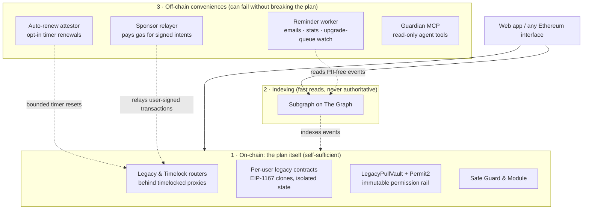

# Architecture

10102 Computing Legacy is deliberately layered so that the **on-chain layer is self-sufficient**, and the **off-chain layer is strictly additive**. If the off-chain services disappeared tomorrow, every existing legacy and timelock would still function: you'd lose email reminders and the pretty UI, but you'd keep the plan.

## The layers

### 1. On-chain: the core plan

Solidity contracts on Ethereum. Deployed behind upgradeable proxies administered by a `ProxyAdmin` that is owned by a public 48-hour upgrade timelock; see [Upgrade Policy](upgrade-policy.md). Verified on Etherscan and published at [github.com/10102-io/computing-sc](https://github.com/10102-io/computing-sc).

- **Legacy routers**: `MultisigLegacyRouter`, `TransferLegacyRouter` (Safe owners), `TransferEOALegacyRouter` (plain EOAs).
- **Timelock router**: `TimeLockRouter`.
- **Per-user legacy contracts**: deployed deterministically via `LegacyDeployer` using `CREATE2`, so the address is predictable before deployment.
- **Safe integration**: a Safe Guard tracks last-activity timestamps; a Safe Module executes activation (adding owners or transferring assets).
- **Premium contracts**: `PremiumSetting` stores watcher/reminder configuration (addresses only; reminder emails live off-chain); `PremiumRegistry` records subscriptions; `PremiumReminderView` is a standalone read-only contract the reminder service polls for due reminder windows.

Full address list, for every deployed contract and network, lives in `contract-addresses.json` of the `computing-sc` repository.

### 2. Indexing: The Graph

A single subgraph per chain provides fast, reliable read access to the parts of the system that would be painful to query from raw RPC:

- **Legacy/timelock/reminders subgraph**: indexes every event emitted by the routers and 10102-enabled Safes: creations, edits, deletions, activations, reminder configurations, and the PII-free `LegacyEmailNotifyRequested` notify events (as `NotifyRequested`) that the off-chain reminder worker consumes. The UI reads the bulk of its state from here.

Everything else is direct on-chain. Token balances for the "your assets" pickers during legacy creation are fetched via viem against the canonical `TokenWhitelist` contract plus per-token ERC-20 `balanceOf` (`src/services/web3-assets-service.ts`). System-wide aggregates (total value locked across all legacies, timelocks and 10102-enabled Safes) are computed by the admin panel via `Multicall3` plus ERC-20 `balanceOf` / `allowance` walks against the entity set returned by the subgraph; see the `computing-admin` repository for the implementation.

The UI prefers subgraph reads for the indexed data but falls back to direct on-chain reads (via viem) for post-mutation freshness, so stale subgraph data never blocks a newly-valid action.

### 3. Off-chain services

Strictly additive layers that improve UX but can fail without breaking the plan:

- **Reminder worker**: an off-chain service (Railway + Postgres) that drives email reminder evaluation and delivery. It reads PII-free notify events from the subgraph plus a read-only on-chain "due" view (`PremiumReminderView`), keeps recipient emails encrypted off-chain, and sends through the mail service. This **replaces the retired Chainlink Automation cron and Chainlink Functions email path** (decommissioned on mainnet 2026-06-02).
- **Auto-renew attestor**: a dedicated key, run alongside the reminder worker, that serves EOA legacies whose owner has **opted in** to auto-renew (Premium): it observes the owner's public transaction count and resets the inactivity timer for them near the deadline, within strict on-chain bounds. It can only delay activation, never accelerate it. See [EOA Activity & Auto-Renew](eoa-activity-auto-renew.md).
- **Sponsor relayer**: accepts a user's signed EIP-712 intent (a beneficiary's claim, or an owner's check-in), submits the transaction, and pays the gas. All safety bounds are verified by the contract; relaying is permissionless. See [Gas-Sponsored Intents](gas-sponsored-intents.md).
- **Guardian MCP**: a read-only [Model Context Protocol](https://modelcontextprotocol.io) service for AI agents: indexed legacy/timelock reads, portfolio health, and pre-filled setup links. See [Agents & Builders](../agents-and-builders.md).
- **Mailjet**: SMTP delivery for reminder emails, behind the 10102 mail proxy the worker posts to.
- **Public RPC providers + Etherscan**: fallback read paths the UI can switch to.

## Section index

- [Legacy Contracts Created with Safe SDK](legacy-contracts-created-with-safe-sdk.md): how Multisig and Safe-backed Transfer legacies work, including the Safe Guard and Safe Module integration.
- [Legacy Contracts Created with EOAs](legacy-contracts-created-with-eoas.md): how pure-EOA Transfer legacies work, including the approval model and CREATE2 deployment.
- [How Legacy Creation Works (v2)](create-flow-v2.md): the one-transaction create (EIP-1167 clones, Permit2 permissions to the immutable `LegacyPullVault`, transaction-based consent, PII-free events).
- [New Account Generation for Beneficiaries](new-account-generation-for-beneficiaries.md): client-side keypair generation for beneficiaries without an Ethereum address.
- [Indexing & Activity Tracking](indexing-and-activity-tracking.md): how The Graph keeps the UI fast, and how the on-chain inactivity timers decide activation.
- [EOA Activity & Auto-Renew](eoa-activity-auto-renew.md): the opt-in attestor that lets an EOA owner's general wallet activity renew their timer, with all safety bounds on-chain.
- [Gas-Sponsored Intents](gas-sponsored-intents.md): how beneficiaries claim without holding ETH with signature-authorized intents, relayed and paid for by 10102.
- [Email Reminders](email-reminders.md): the off-chain encrypted reminder-worker that sends out-of-band notifications (replacing the retired Chainlink path).
- [Upgrade Policy](upgrade-policy.md): how contract upgrades work through a public, on-chain 48-hour queue that anyone can watch.

## A note on upgradeability

Every contract deployed by 10102 sits behind a transparent upgradeable proxy administered by a single `ProxyAdmin`, and that ProxyAdmin is owned by an on-chain **upgrade timelock**: no implementation can change without first sitting in a public queue for 48 hours, during which anyone can inspect the queued code and we can cancel. We can patch bugs and ship improvements. We _cannot_ silently drain assets or retroactively alter an existing legacy's terms. Beneficiaries, owners, allocations, and activation windows are stored in per-legacy state that upgrades leave intact. The full commitment, including what is deliberately *not* timelocked and how to watch the queue yourself, is in [Upgrade Policy](upgrade-policy.md).
