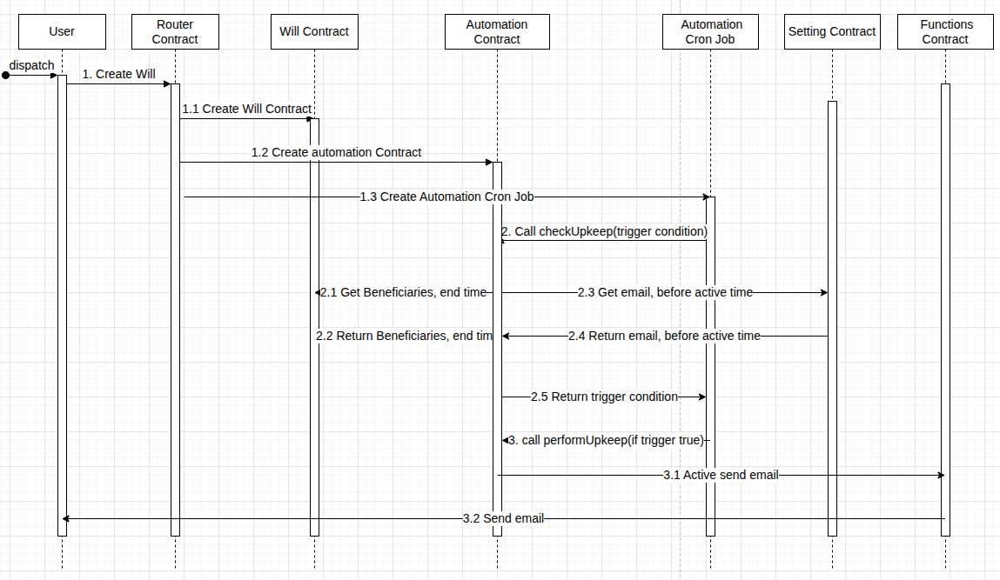

# Email Reminders

Email reminders are an opt-in Premium capability that gives owners and beneficiaries out-of-band notifications at key moments in a legacy's lifecycle. They are **additive**: the on-chain contract doesn't depend on email delivery, and the whole email layer can fail without affecting the legality or executability of a legacy.

For the user-facing behavior (what events trigger emails, who gets what), see [Configure Email Reminders](../user-guide/premium-features/configure-email-reminders.md). This page covers the architecture.

## Components

| Component | Role |
|---|---|
| Router contract | Deploys the per-legacy contracts at legacy creation. Not directly involved in reminders. |
| `PremiumSetting` | Stores reminder configuration: email addresses, which beneficiaries to notify, advance-notice windows. |
| `Automation` contract | Owns the `checkUpkeep` / `performUpkeep` pattern. Reads from per-legacy contracts and from `PremiumSetting` to evaluate whether a reminder is due. |
| Chainlink Automation (cron) | Off-chain automation service that calls `checkUpkeep` on the `Automation` contract once per day. |
| Chainlink Functions | Bridges the `Automation` contract's "please send email" signal to an off-chain HTTPS call. |
| Mailjet | SMTP-as-a-service provider that actually puts email in recipients' inboxes. |

All on-chain pieces live in the public [`computing-sc`](https://github.com/10102-io/computing-sc) repository.

## Workflow

<figure><figcaption>
Reminder evaluation and delivery flow.
</figcaption></figure>

### Step 1 — Subscription and configuration

1. The owner purchases a Premium subscription (paid in ETH, USDC, or USDT to the `PremiumRegistry` contract). The subscription is on-chain, time-bound, and scoped to the paying wallet.
2. While Premium is active, the owner configures reminders via `PremiumSetting.setReminderConfigs(...)` — specifying email recipients, which beneficiaries to notify, and the advance-notice window (e.g. "14 days before activation").
3. `PremiumSetting` stores this configuration on-chain. A Chainlink Automation cron job is registered against the `Automation` contract, scheduled to run daily.

### Step 2 — Daily evaluation

Once per day, the Chainlink Automation cron fires:

1. Chainlink Automation calls `Automation.checkUpkeep(bytes)`.
2. `checkUpkeep` reads from each registered legacy:
   - Beneficiary addresses and last-activity timestamp from the per-legacy contract.
   - Activation trigger (inactivity window) from the per-legacy contract.
   - Email recipients and advance-notice windows from `PremiumSetting`.
3. For each legacy, `checkUpkeep` computes: _is the current time within any configured reminder window for any configured event?_ Reminder events include "approaching activation," "activation timeline reset," "activation eligible," and "claim successful."
4. `checkUpkeep` returns `(bool upkeepNeeded, bytes performData)` — with `performData` encoding which legacies and which reminder events need firing.

### Step 3 — Reminder dispatch

1. If `upkeepNeeded == true`, Chainlink Automation calls `Automation.performUpkeep(performData)`.
2. `performUpkeep` validates the decoded data and calls `ChainlinkFunctions.sendEmail(recipients, legacyId, eventType)` — one call per (recipient, event) tuple.
3. Each Chainlink Functions request executes on multiple oracle nodes. Each node makes an HTTPS POST to 10102's mail service (which wraps Mailjet's SMTP).
4. Mailjet delivers the email to the recipient's provider (Gmail, Outlook, ...).

### Known trade-off: duplicates

Chainlink Functions executes on multiple nodes for reliability. Mailjet does not natively deduplicate identical SMTP requests. The consequence: **the same reminder email may arrive more than once** when the oracle consensus fans out across many nodes. This is a known limitation of combining a decentralized oracle with a centralized email-delivery API, and does not affect on-chain correctness. Deduplication keys on the mail-service side are on the roadmap to mitigate this.

## Why daily

A daily cron is the sweet spot between:

- **Responsiveness** — most reminder windows are measured in days (e.g. "14 days before activation"), so sub-daily precision adds cost without adding value.
- **Chainlink subscription cost** — upkeep calls consume LINK. Running hourly would 24x the bill for marginal benefit.
- **Email fatigue** — people tolerate "1 email per event per day" much better than "4 emails per event per day."

If a reminder window is narrower than a day (e.g. "notify 1 hour before activation"), it gets rounded up to the next daily evaluation. This is an accepted limitation documented in the user guide.

## Privacy and opt-in

- Email addresses are stored **on-chain** in `PremiumSetting`. Anyone with a chain reader can see them. This is a deliberate trade-off: the plan must survive 10102, which means no secret data held by 10102's backend.
- Reminders are strictly opt-in per recipient. An owner cannot secretly enroll a beneficiary's email; the flow requires the owner to input the address explicitly.
- 10102 never asks a beneficiary to sign anything to "enable reminders." If a recipient ever gets an email claiming they need to sign or connect a wallet to continue receiving reminders, it's not us.

## What happens when email breaks

If the email layer is entirely broken (Chainlink Functions down, Mailjet down, our mail service down), the only consequence is that reminder emails don't send. The legacy itself continues to work exactly as specified on-chain. A beneficiary whose reminder never arrives can still activate on time via the app or via Etherscan — using the [Legacy Claim Card](../user-guide/legacy/legacy-claim-card.md) — because the on-chain state has all the information needed.

This is the "plan survives us" principle in action: email reminders are a _better experience_, never a _requirement_.
