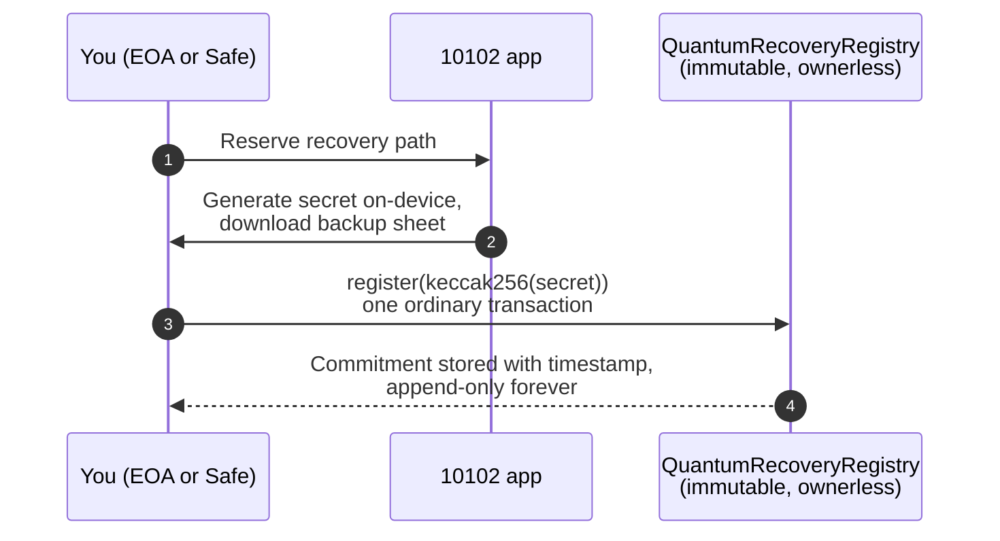

# Quantum Readiness

Your 10102 plan is measured in decades. On that horizon, one risk stands out
as both real and widely misunderstood: sufficiently large quantum computers
are expected to break the elliptic-curve signatures (secp256k1 ECDSA) that
every Ethereum wallet uses today. This page explains the honest threat
model, what we ship now, and where it goes next.

One vocabulary rule up front: nothing here is "quantum-proof". We say
**quantum-ready**, and we mean exactly what is written below, no more.

## The threat, honestly

* **No quantum computer today can break an Ethereum key.** Current machines
  are several orders of magnitude short of the roughly 1,200 to 1,450
  error-corrected (logical) qubits the attack needs. Credible estimates for
  a cryptographically relevant machine cluster around 2030 to 2035.
* **The margin is shrinking, not growing.** Research published in 2026 cut
  the estimated hardware requirement by roughly 20x versus prior estimates,
  and major hardware roadmaps now target hundreds of logical qubits before
  2030. The comfortable "decades away" framing is gone.
* **Not all addresses are equally exposed.** An Ethereum address is a hash
  of the public key. A wallet that has **never signed a transaction** only
  reveals that hash, which quantum algorithms barely dent; it is in a
  strong position. A wallet that **has signed** reveals its public key
  forever, and an exposed key is exactly what a future quantum computer
  could target.
* **A Safe is a special case.** The Safe's own address derives from no key,
  so there is nothing to expose at the Safe itself. Its owners' keys are
  the attack surface: every co-signed transaction publishes an owner
  signature. An attacker would need to break threshold-many owner keys.
* **AI does not break cryptography.** There is no credible evidence that
  machine learning threatens ECDSA or keccak256 mathematically. AI's real
  contribution to this risk is indirect: it may accelerate quantum hardware
  engineering. We will never market "protection against AI cracking your
  keys"; that claim would be theater.

## The recovery paradox, and why acting early matters

If ECDSA breaks, an attacker holding your cracked key is cryptographically
indistinguishable from you. No future rescue mechanism, whether built by
10102 or by Ethereum itself, can tell owner from thief at that point,
**unless a quantum-safe second factor was bound to the account before the
break**.

That is the entire logic of acting now. A commitment (the hash of a secret
only you hold) stored on-chain today costs one small transaction. Hashes
are safe against quantum attack, so registering reveals nothing. What the
chain provides is the one thing that cannot be forged after the fact: the
**timestamp**. Any recovery mechanism that appears later can honor
commitments recorded before a publicly agreed breach date and reject
everything after it.

## What we ship today

### The readiness readout

The dashboard shows a quantum readiness card for the connected account:

* Whether the account is an EOA or a smart account.
* For EOAs, whether the public key is already exposed (the wallet has
  signed before) or still shielded behind its hash.
* Whether a recovery commitment is registered, and since when.

Agents can query the same facts through the Guardian MCP tool
`get_quantum_readiness`. See [Agents & Builders](../agents-and-builders.md).

### The recovery registry

[`QuantumRecoveryRegistry` on Etherscan](https://etherscan.io/address/0xaB3C8C69fD17ba980b3D11064200c866904e360E#code)
is deliberately minimal:

* **Append-only.** Registering again never erases an earlier entry, because
  the earliest pre-breach timestamp is exactly what a future verifier
  needs.
* **Ownerless and immutable.** No admin, no proxy, no pause switch. A
  "quantum-safe" registry whose admin key could rewrite history would
  undercut its own claim.
* **Address-agnostic.** An EOA (hardware wallets included) registers by
  signing one normal transaction. A Safe registers by routing the same call
  through its usual transaction flow, so the commitment is recorded for the
  Safe address itself. There is no dependency on Safe or on any wallet
  brand.

The app's register flow generates a fresh 32-byte secret on your device,
has you download a printable backup sheet (the only copy), and registers
`keccak256(secret)` on-chain. The secret never leaves your device except on
that sheet. Losing the sheet risks no funds; it only forfeits the head
start, and you can register a fresh secret at any time.

## What this does not do, stated plainly

The registry is a **readiness step, not an enforcement mechanism**. Nothing
in it can move funds, veto a transaction, or stop an attacker today. Its
value is the provable pre-break timestamp, which future enforcement (a
delay vault with a hash-based veto, a Safe module, or Ethereum's own
post-quantum recovery plans, all of which are actively developed in the
ecosystem) can honor. We would rather tell you exactly what you bought than
sell you a stronger-sounding claim.

## Where this goes next

The natural next layers, in the order we expect to build them:

1. **Delay plus veto.** Withdrawals announce themselves and wait; during
   the window, revealing the pre-registered secret can veto a thief. This
   extends our existing timelock machinery and works even against an
   attacker who fully controls your broken key.
2. **A Safe module** adding the same delay and veto to an existing Safe
   without moving funds.
3. **A standalone protected holding contract** for users who want the delay
   and veto without a Safe at all.

Practical hygiene that costs nothing meanwhile: prefer receiving long-term
holdings at fresh addresses that have never signed, and treat a Safe (whose
address exposes no key) as a better long-term container than a well-used
EOA.
