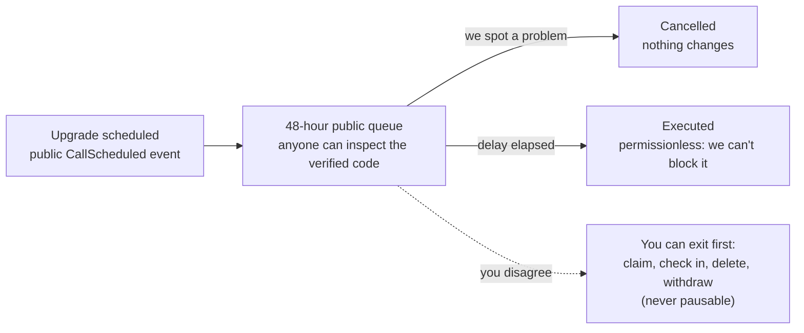

# Upgrade Policy

10102 is non-custodial: your assets stay in your wallet or in contracts only
you control. But parts of the protocol (the routers that create legacies and
timelocks, the premium stack) are upgradeable proxies, and an upgradeable
contract is only as trustworthy as its upgrade process. This page is our
standing commitment on how upgrades work, written so a stranger can verify
every claim on-chain.

## The one-sentence version

**No contract implementation can change without first sitting in a public,
on-chain queue for 48 hours, and nothing that lets you exit (claim,
check in, delete, withdraw) can ever be paused.**

## How it works

Every upgradeable proxy in the protocol is administered by a single
`ProxyAdmin` contract, and that ProxyAdmin is owned by a **timelock**
([`UpgradeTimelock` on Etherscan](https://etherscan.io/address/0xc0Fee69ffAA1d62D701Bb277031CEc0d98AFA4Ad#code),
based on OpenZeppelin's audited `TimelockController`):

1. An upgrade is **scheduled** on the timelock. This emits a public
   `CallScheduled` event naming the target contract and the new
   implementation.
2. It **waits at least 48 hours**. During this window anyone can inspect the
   queued implementation's verified source code, and we can cancel.
3. Only then can it **execute**. Execution is permissionless: once the
   delay has passed, we cannot block a queued operation, and before it has
   passed, we cannot accelerate it.

The timelock administers itself: changing the delay or the roles is itself a
queued, delayed operation.

## What we will and won't upgrade

- **We will** ship upgrades for security fixes, gas savings, and new
  features, announced in the changelog when they are queued, not after they
  land.
- **We won't** upgrade in ways that move or restrict user assets: claims,
  check-ins, deletions and withdrawals are permanent capabilities. They are
  not pausable today, and no upgrade weakening them will be queued.
- **Existing legacy contracts never hot-swap.** Each legacy clone pins its
  implementation and its Permit2 vault at creation time. Upgrades affect
  how NEW contracts are created; your existing contract keeps the exact
  code you audited (or your beneficiary's claim card references) forever.

## What is deliberately NOT timelocked

Honesty over theater. Two classes of admin action work instantly:

- **The create pause.** In an active incident we can halt NEW legacy
  creation immediately. Exit paths are unaffected: pausing can protect new
  users, never trap existing ones.
- **Operational settings** (token whitelists, plan configuration, rotation
  of the clone implementation / pull vault used for *new* creates). These
  cannot touch existing contracts or user balances; the blast radius is
  limited to new creations, which the 48-hour window doesn't meaningfully
  protect anyway.

## The honest limit

The timelock is a transparency window, not multi-party control (yet). A
compromised maintainer key could still queue a malicious upgrade, but it
cannot land silently: our monitoring alerts on every queued operation, we
have 48 hours to cancel, and you have 48 hours to exit if you disagree with
any queued change. Moving the proposer role to a multisig is the planned
next hardening step, and thanks to the timelock, that change will itself be
publicly visible when it happens.

## Watch the queue yourself

- Timelock contract (mainnet):
  [`0xc0Fee69ffAA1d62D701Bb277031CEc0d98AFA4Ad`](https://etherscan.io/address/0xc0Fee69ffAA1d62D701Bb277031CEc0d98AFA4Ad).
  Watch the `CallScheduled`, `CallExecuted` and `Cancelled` events (the
  Events tab on Etherscan, or an address watch/alert service pointed at the
  contract).
- ProxyAdmin (owned by the timelock):
  [`0xA41299408EB78D67B9b599e38E3259C11A005145`](https://etherscan.io/address/0xA41299408EB78D67B9b599e38E3259C11A005145).
  Its `owner()` is the timelock; verify it yourself.
- Every implementation we queue is verified on Etherscan before scheduling,
  so the diff is inspectable during the full waiting period.
