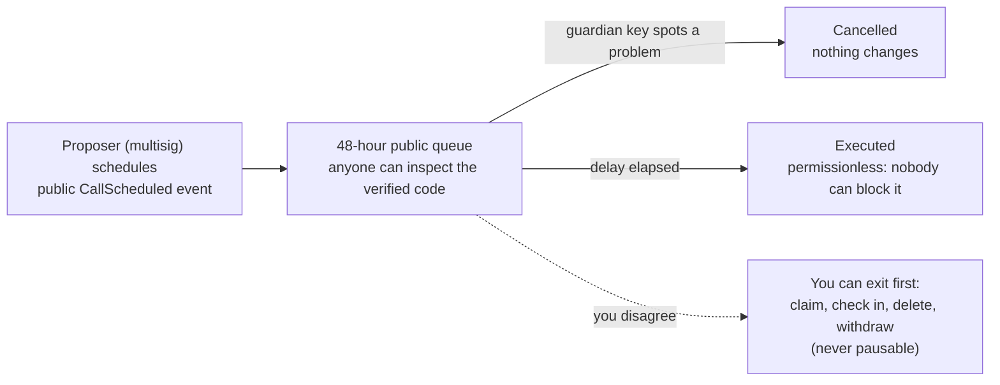

# Upgrade Policy

10102 is non-custodial: your assets stay in your wallet or in contracts only
you control. But parts of the protocol (the routers that create legacies and
timelocks, the premium stack) are upgradeable proxies, and an upgradeable
contract is only as trustworthy as its upgrade process. This page is our
standing commitment on how upgrades work, written so a stranger can verify
every claim on-chain.

## The one-sentence version

**No contract implementation can change without first sitting in a public,
on-chain queue for 48 hours; the key that queues an upgrade and the key
that can stop it are different devices; and nothing that lets you exit
(claim, check in, delete, withdraw) can ever be paused.**

## How it works

Every upgradeable proxy in the protocol is administered by a single
`ProxyAdmin` contract, and that ProxyAdmin is owned by a **timelock**
([`UpgradeTimelock` on Etherscan](https://etherscan.io/address/0xc0Fee69ffAA1d62D701Bb277031CEc0d98AFA4Ad#code),
based on OpenZeppelin's audited `TimelockController`):

1. An upgrade is **scheduled** on the timelock by a **proposer**. This
   emits a public `CallScheduled` event naming the target contract and the
   new implementation.
2. It **waits at least 48 hours**. During this window anyone can inspect the
   queued implementation's verified source code, and a **canceller** can
   stop it.
3. Only then can it **execute**. Execution is permissionless: once the
   delay has passed, nobody can block a queued operation, and before it has
   passed, nobody can accelerate it.

The timelock administers itself: changing the delay or the roles is itself a
queued, delayed operation.

## Who holds which key

Since 24 September 2026 the roles are split across devices, so that no
single key can both queue a change and wave it through:

| Role | Holder | Can do | Cannot do |
|---|---|---|---|
| Proposer | The governance multisig, a [Safe](https://app.safe.global) at [`0x60B3da49f05E21a1fcD7e210075A23b75939C3eA`](https://etherscan.io/address/0x60B3da49f05E21a1fcD7e210075A23b75939C3eA) | Queue upgrades and role or delay changes | Execute early, cancel |
| Proposer (transitional) | The maintainer key `0xfe8b…b630` | Queue routine upgrades from scripts | Cancel; it loses the proposer role once the Safe is 2-of-3 |
| Canceller | A hardware wallet, [`0x7B61dD775422f465D6b9f28C8EFEE39263ef2579`](https://etherscan.io/address/0x7B61dD775422f465D6b9f28C8EFEE39263ef2579), never connected to a browser extension | Stop anything queued | Queue anything |
| Executor | Anyone | Execute an operation whose delay has passed | Execute early |
| Admin | The timelock itself | Grant or revoke roles, change the delay, all through the same queue | Act instantly |

The Safe starts with a threshold of one signer while its third owner is
added; raising it to two of three is the next change, and it is visible
on the Safe itself. Read the live table any time: `hasRole` on the
timelock, or the open-source `verify-governance` script in the contracts
repository, which prints every row above as pass or fail.

What the timelock and the Safe own today:

- The `ProxyAdmin` of every proxy, and the three timelock vaults that
  hold every escrowed timelock and gift (their settings, such as the swap
  router an ETH gift uses at claim, are queued operations too).
- The timelock router (creation settings and the create pause) is owned by
  the Safe.

## What we will and won't upgrade

- **We will** ship upgrades for security fixes, gas savings, and new
  features, announced in the changelog when they are queued, not after they
  land.
- **We won't** upgrade in ways that move or restrict user assets: claims,
  check-ins, deletions and withdrawals are permanent capabilities. They are
  not pausable today, and no upgrade weakening them will be queued.
- **Existing legacy contracts never hot-swap.** Each legacy clone pins its
  implementation and its Permit2 vault at creation time. Upgrades affect
  how NEW contracts are created; your existing contract keeps the exact
  code you audited (or your beneficiary's claim card references) forever.

## What is deliberately NOT timelocked

Honesty over theater. Two classes of admin action work instantly:

- **The create pause.** In an active incident we can halt NEW legacy or
  timelock creation immediately (from the maintainer key for legacies,
  from the Safe for timelocks). Exit paths are unaffected: pausing can
  protect new users, never trap existing ones.
- **Operational settings** (token whitelists, plan configuration, rotation
  of the clone implementation / pull vault used for *new* creates). These
  cannot touch existing contracts or user balances; the blast radius is
  limited to new creations, which the 48-hour window doesn't meaningfully
  protect anyway.

## The honest limit

The timelock is a transparency window with a brake, not yet full
multi-party control. Until the Safe is two-of-three, the maintainer key can
still queue an upgrade on its own; what it can no longer do is cancel, and
what it never could do is skip the queue. A malicious or mistaken operation
cannot land silently: our monitoring alerts on every `CallScheduled`, the
guardian key has 48 hours to cancel, and you have 48 hours to exit if you
disagree with any queued change. The remaining steps, in order and each
visible on-chain when it happens: the Safe to two of three, the maintainer
key losing the proposer role, and the delay rising from 48 hours to 7
days.

## Watch the queue yourself

- Timelock contract (mainnet):
  [`0xc0Fee69ffAA1d62D701Bb277031CEc0d98AFA4Ad`](https://etherscan.io/address/0xc0Fee69ffAA1d62D701Bb277031CEc0d98AFA4Ad).
  Watch the `CallScheduled`, `CallExecuted` and `Cancelled` events (the
  Events tab on Etherscan, or an address watch/alert service pointed at the
  contract).
- ProxyAdmin (owned by the timelock):
  [`0xA41299408EB78D67B9b599e38E3259C11A005145`](https://etherscan.io/address/0xA41299408EB78D67B9b599e38E3259C11A005145).
  Its `owner()` is the timelock; verify it yourself.
- Roles: call `hasRole(role, account)` on the timelock with
  `PROPOSER_ROLE`, `CANCELLER_ROLE` or `EXECUTOR_ROLE`
  (`keccak256` of those strings) and the addresses in the table above.
- Every implementation we queue is verified on Etherscan before scheduling,
  so the diff is inspectable during the full waiting period.
- Changelog entries are written when an operation is queued, with its
  operation id and the time it becomes executable, not after it lands.
