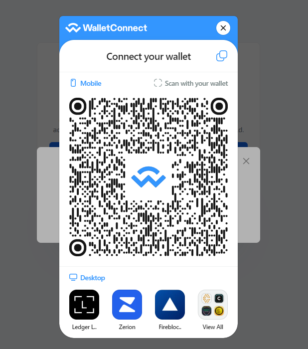
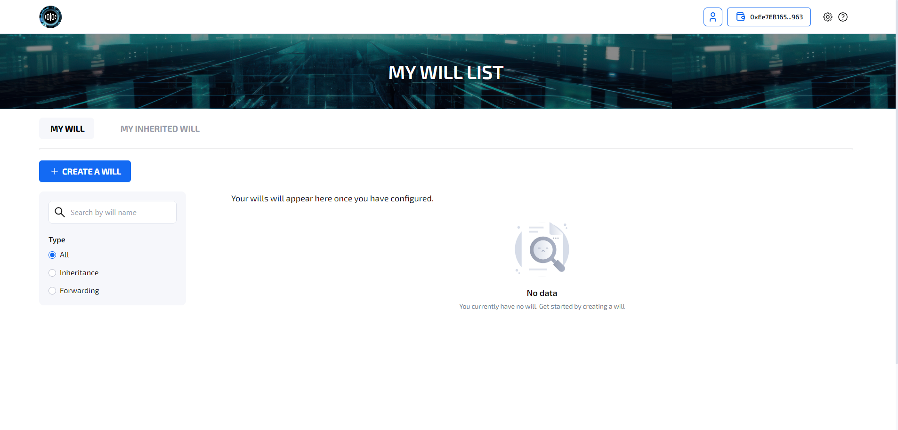
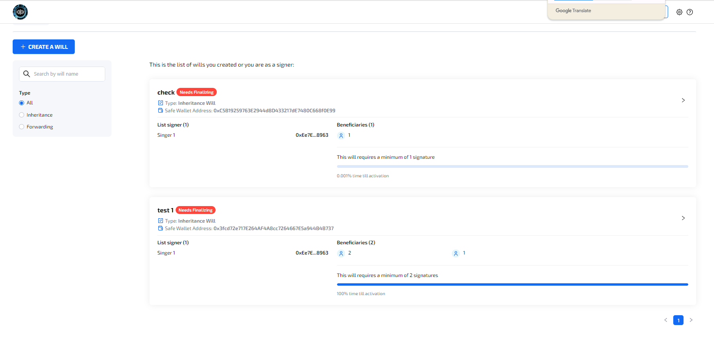
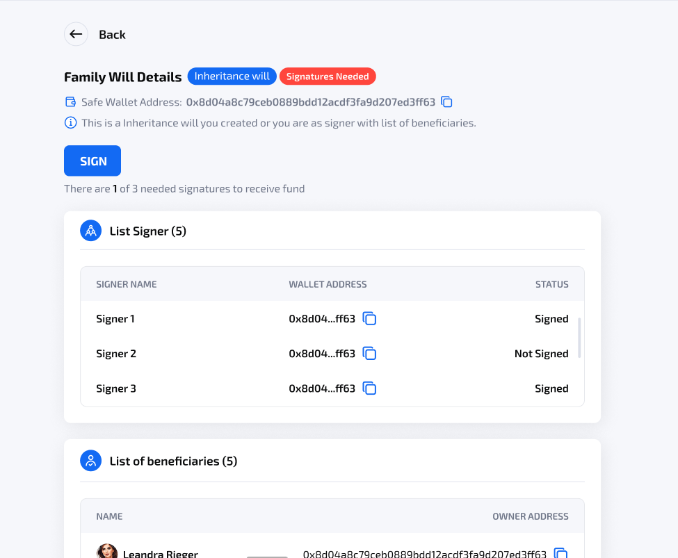
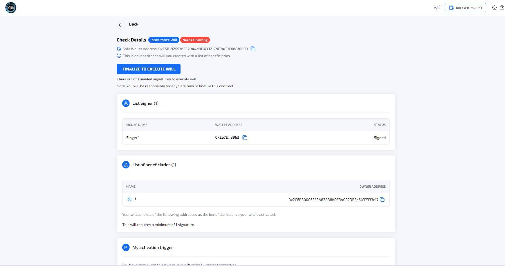
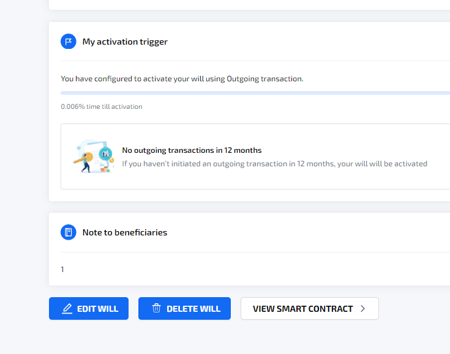

# \[Computing Will] User guide

USER GUIDE

**COMPUTING WILL**

_July 2024_

_Version 1.0_

**Table of Contents**

**1 Introduction 3**

1.1 Scope and Purpose 3

1.2 Process Overview 3

**2. Manual Guide 4**

2.1 Authentication 4

2.1.1 Connect with Metamask wallet/ DApp 4

2.1.2 Log out 4

**3. Appendices 5**

**4. Index 6**

### **Introduction** 

### **Scope and Purpose** 

This manual guide document provides comprehensive instructions and information to assist users in effectively and efficiently utilizing the Computing Will system.

This document typically encompasses all aspects of the product's functionality, features, and usage, ensuring that users can navigate and utilize the product with ease.

### **Process Overview** 

Computing Will is a system that uses the Ethereum network, allowing users to create many different inheritance contracts by setting Safe Account as the owner of an inheritance contract. Users can set the details of the inheritance contract such as: Will name, list of beneficiaries, activation trigger time, note to beneficiaries.

In addition, this platform brings fairness when using the multi-signatures feature (similar to the mechanism of Safe Wallet) to transfer assets to beneficiaries.

### **2. Manual Guide** 

Computing Will app only supports Metamask and Wallet Connect wallet on Ethereum network. Users need to connect to their Metamask/ Wallet connect wallet successfully to use the application functions.

Access Computing Will by entering [Computing Will (sotatek.works)](https://stg.computingwill.sotatek.works/no-auth)

### **2.1 Authentication** 

#### **2.1.1 Connect wallet** 

Precondition:

1. User click Connect Wallet to open Pop-up:

* If user choose Metamask:
  * If user have not install Metamask before -> The screen will show as below:

\-> User click “Metamask” to navigate to [https://metamask.io/download/](https://metamask.io/download/)

* If user have had Metamask before

1. Click Wallet Connect to -> Show QR code to connect with Wallet connect

1. Once logged in -> Navigate to My Will List

#### **2.1.2 Log out** 

1. To logout -> Click Wallet Address on top right
2. Click disconnect

User will navigate to Connect Wallet screen

### **2.2 Profile** 

#### **2.2.1 Set up profile** 

1. Click nametag on bottom right of the screen -> Open Manage profile screen\
   

* In this screen, the user can set up: avatar, name, email. Gender and their country.
* After set up profile successfully -> Navigate to My Will List screen

#### **2.2.2 Change profile** 

1. Click nametag on bottom right of the screen -> Open Manage profile screen with initial value:

\

* In this screen, the user can update: avatar, name, email. Gender and their country.
* After set up profile successfully -> Navigate to My Will List screen

### **2.3 My will list screen** 

#### **2.3.1 My will** 

1. If there is no will before -> Show No data screen as above
2. If there are wills -> Show will list as below:\
   

* User can view all wills they create or as a signer
* User can filter or search will with search bar and ratio
* User can click to right arrow of each will tag to view **My will details screen**

**2.3.1.1 My will details screen**

1. After creating, this will has the status of **Signature needed**, signer can access Computing will system to sign or provide signatures is Safe wallet platform too.

1. When enough signatures -> The status of will is updated to **Need Finalizing** as below

_My will details screen_

* In details screen of **Need Finalizing** status, user can click finalize to pay gas fee and finalize this will to contract ( user can execute this transaction in Safe Wallet platform as similarly)
* If the will status is Live -> user can **edit/delete** the will by clicking button **Edit will/ Delete will**

* Click **Edit will** -> Navigate to **Configure will screen** with initial value
  * After edit will and sign first signature -> Status back to **Signature Needed to update**
* Click **Delete will** -> Open PU: Confirmation

* Click **Delete now** -> Open Metamask extension to Sign -> Navigate to my will list screen and update status of will to **Signature Needed to Delete**

#### **2.3.2 My Inherited will** 

_No data screen_

* User can view list of Inherited wills they are as beneficiaries and co-signer
* Click right arrow in right side of the tag to view will details screen

**2.3.2.1 My inherited will details screen**

* User can click Check will’s status -> Open metamask extension to check time trigger of will
  * If it qualified -> this user pay gas fee to set list of beneficiaries to become signer of this will

### **2.4 Create will** 

1. User click con “Create a will” in My will list screen
2. Open PU: Choose will type\
   
3. In this phase, we only do with Inheritance will so Forwarding selection is disable
4. Click Inheritance -> Click “Create a will” -> Navigate to **Create Will screen**
   1. First, user have to check their Safe Wallet in Checking your Safe Wallet screen
   2. Next, user have to input the address into text box
      1. If user have not Safe account before -> Click [Safe{Wallet} – Welcome](https://app.safe.global/) to create a Safe Account in **Safe Wallet platform**\
         
      2. If inputted address is a Safe account -> Enable button Next Step and user can click to navigate to **Configure will screen**

### **3. Appendices** 

_\[Appendices are optional, and are used to provide additional detailed information that may help the end user manage the overall application._

### **4. Index** 

_\[Depending on the size or complexity of the final document, consider pulling together an index to assist the using in location specific information. Index entries correspond to tags or categories, and are useful in navigating long books.]_
