# User guide v2.0

USER GUIDE

**COMPUTING WILL**

_Oct 2024_

_Version 2.0_

**Table of Contents**

**1 Introduction 3**

1.1 Scope and Purpose 3

1.2 Process Overview 3

**2. Manual Guide 4**

2.1 Authentication 4

2.1.1 Connect wallet 4

2.1.2 Log out 8

2.3 My will list screen 9

2.3.1 My will 9

2.3.1.1 My will details screen ( with Safe Wallet flow) 9

2.3.1.2 My will details screen ( with EOA flow) 12

2.3.2 My Inherited will ( With Safe Wallet ) 14

2.3.2.1 My inherited will details screen 15

2.4 Create will 16

**3. Appendices 24**

**4. Index 25**

### **Introduction** 

### **Scope and Purpose** 

This manual guide document provides comprehensive instructions and information to assist users in effectively and efficiently utilizing the Computing Will system.

This document typically encompasses all aspects of the product's functionality, features, and usage, ensuring that users can navigate and utilize the product with ease.

### **Process Overview** 

Computing Will is a system that uses the Ethereum network, allowing users to create many different inheritance contracts by setting a Safe Account as the owner of an inheritance contract or using an individual's wallet to become the owner of a will contract.. Users can set the details of the inheritance contract such as: Will name, list of beneficiaries, asset allocation details, activation trigger time, note to beneficiaries.

In addition, this platform brings fairness when using the multi-signatures feature (similar to the mechanism of Safe Wallet) to transfer assets to beneficiaries. Otherwise, with the owner of the will being the EOA wallet ( individual wallet of the user) the inheritance will be transferred to beneficiaries without a multi-signature mechanism.

### **2. Manual Guide** 

Computing Will app only supports Metamask and Wallet Connect wallet on Ethereum network. Users need to connect to their Metamask/ Wallet connect wallet successfully to use the application functions.

Access Computing Will by entering https://computing-will.sotatek.works/

### **2.1 Authentication** 

#### **2.1.1 Connect wallet** 

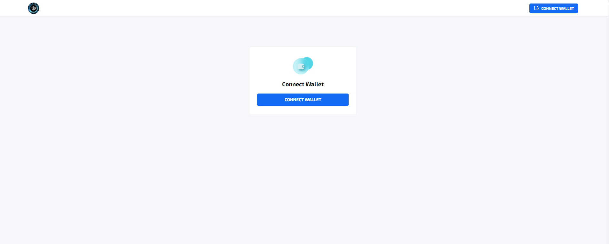

Precondition:

1. User click Connect Wallet to open Pop-up:

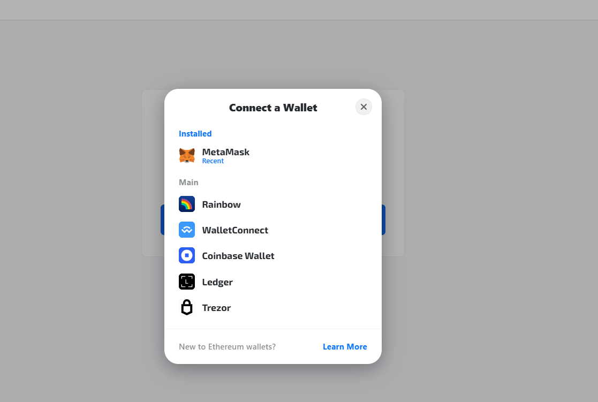

**With Metamask**

*
  * If user have not install Metamask before -> The screen will show as below:

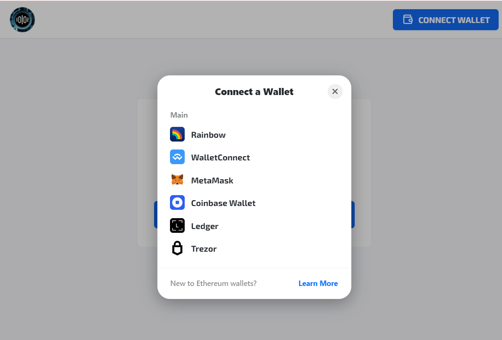

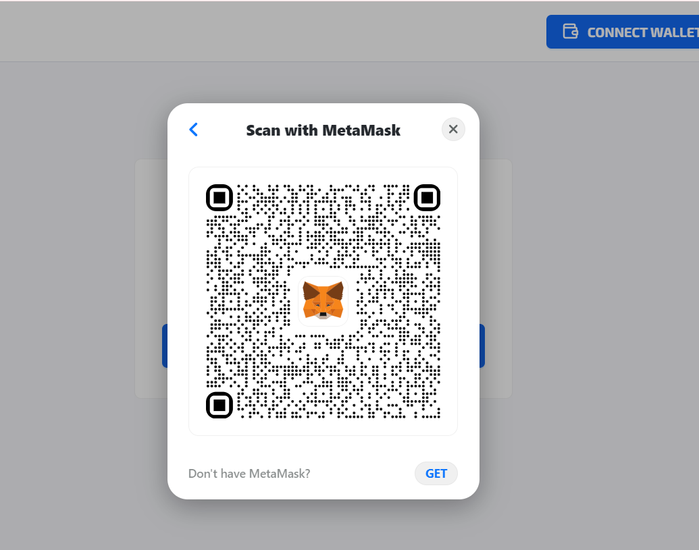

**With Wallet Connect**

* **Click Wallet Connect to** -> Show QR code to connect with Wallet connect

**With Ledger wallet**\
**-> click to open QR:**\
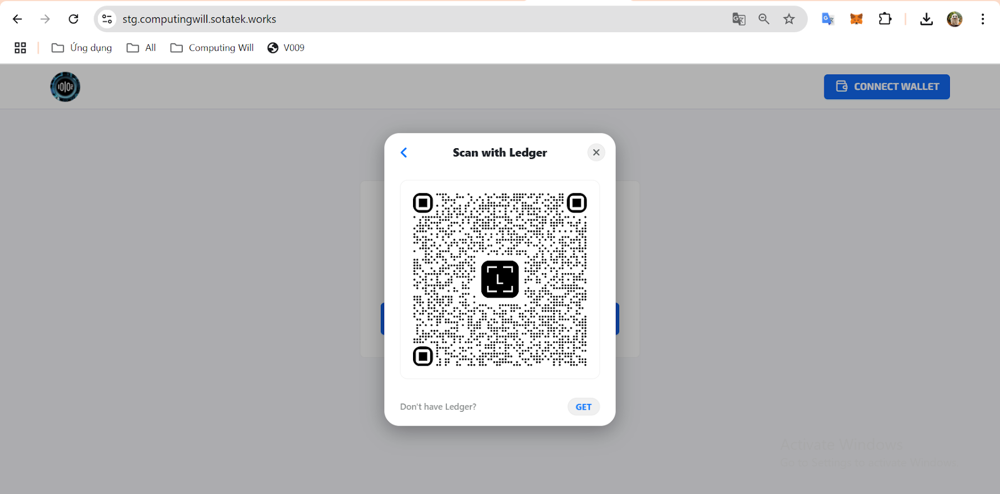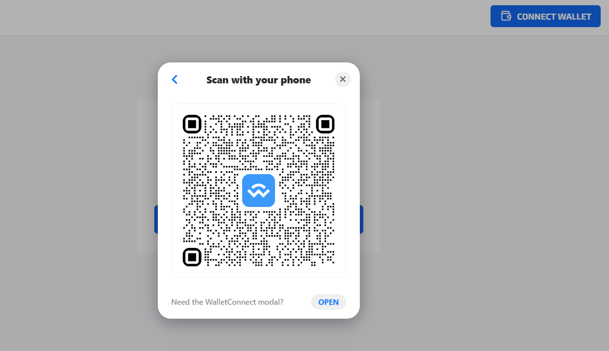

**With Trezor wallet**

**With CoinBase Wallet**

* 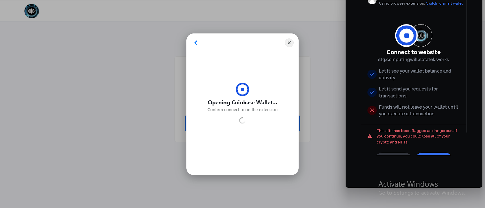Open CoinBase wallet extension and sign to connect wallet

**With Rainbow wallet**\
**-> Click to open extension as same as Metamask**

#### **2.1.2 Log out** 

1. To logout -> Click Wallet Address on top right
2. Click disconnect

User will navigate to Connect Wallet screen

### **2.3 My will list screen** 

#### **2.3.1 My will** 

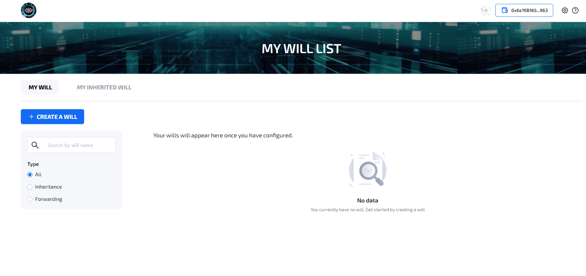

1. If there is no will before -> Show No data screen as above
2. If there are wills -> Show will list as below:\
   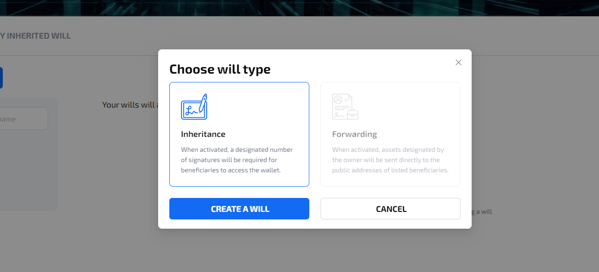

* User can view all wills they create or as a signer
* User can filter or search will with search bar and ratio
* User can click to right arrow of each will tag to view **My will details screen**

**2.3.1.1 My will details screen ( with Safe Wallet flow)**

1. After creating, this will has the status of **Signature needed**, signer can access Computing will system to sign or provide signatures is Safe wallet platform too.

1. When enough signatures -> The status of will is updated to **Need Finalizing** as below

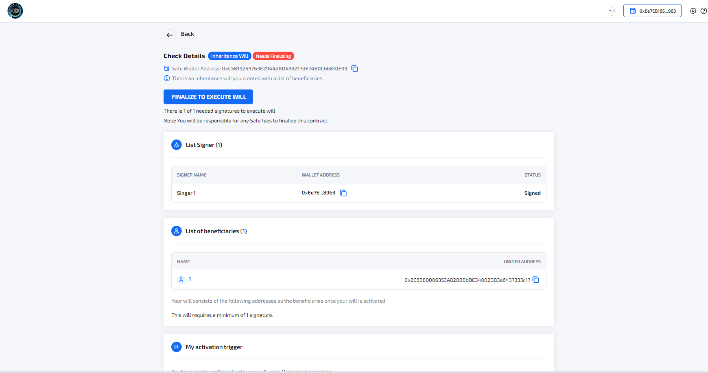

_My will details screen_

* In details screen of **Need Finalizing** status, user can click finalize to pay gas fee and finalize this will to contract ( user can execute this transaction in Safe Wallet platform as similarly)
* If the will status is Live -> user can **edit/delete** the will by clicking button **Edit will/ Delete will**

* Click **Edit will** -> Navigate to **Configure will screen** with initial value
  * After edit will and sign first signature -> Status back to **Signature Needed to update**
* Click **Delete will** -> Open PU: Confirmation

**2.3.1.2 My will details screen ( with EOA flow)**

1. After creating, this will has the status of **Live**, 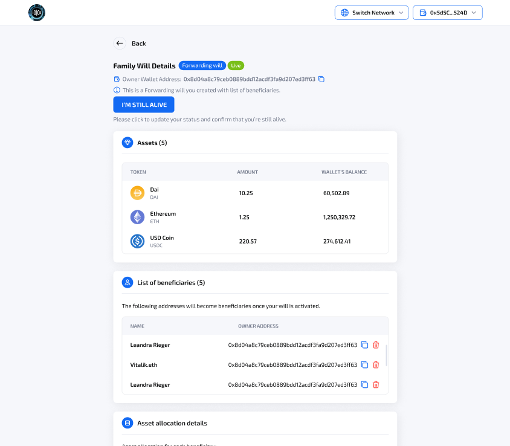

* Users can click the button **“I’m still alive”** to mark as still alive.
* If the will status is Live -> user can **edit/delete** the will by clicking button **Edit will/ Delete will**

* Click **Edit will** -> Navigate to **Configure will screen** with initial value
* After edit will and sign signature -> Status back to **Live** with latest data
* Click **Delete will** -> Open PU: Confirmation

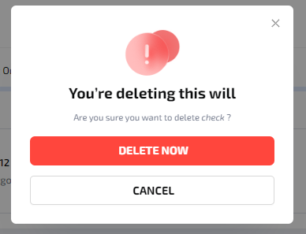

* Click **Delete now** -> Open Metamask extension to Sign -> Navigate to my will list screen and remove this will.

#### **2.3.2 My Inherited will ( With Safe Wallet )** 

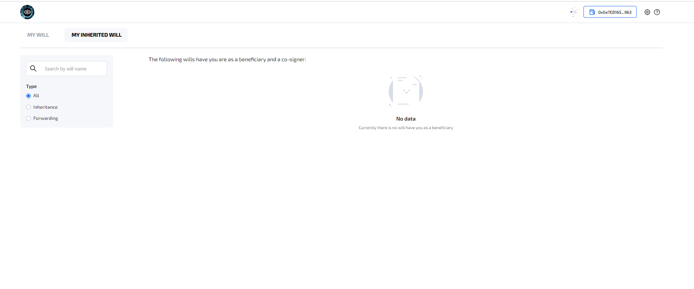

_No data screen_

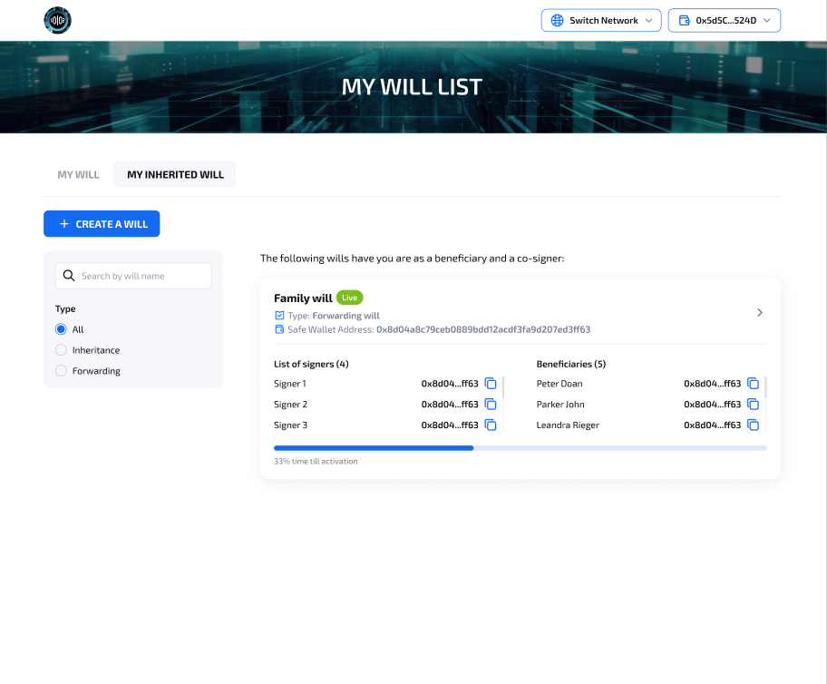

* User can view list of Inherited wills they are as beneficiaries
* Click right arrow in right side of the tag to view will details screen

**2.3.2.1 My inherited will details screen**

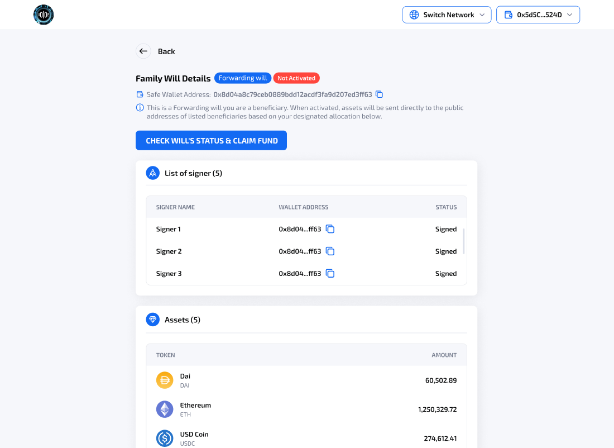

* User can click Check will’s status & Claim Fund -> Open metamask extension to check time trigger of will
  * If it qualified -> this user pays gas fee and all assets will be transferred to all beneficiaries.
    * If all transaction can not be transferred in 1 times -> Show screen with button Claim Remaining Fund\
      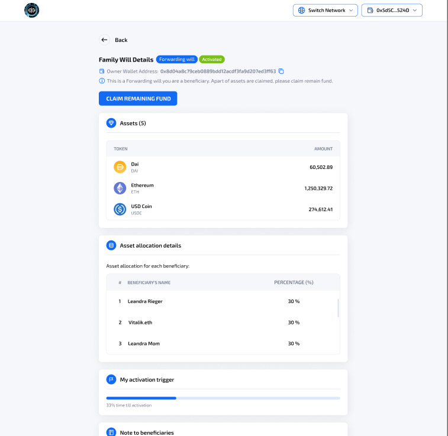
  * If it did not qualify -> keep the status and show a message to the user that the will is not activated.

### **2.4 Create will** 

1. User click con “Create a will” in My will list screen
2. Open PU: Choose will type\
   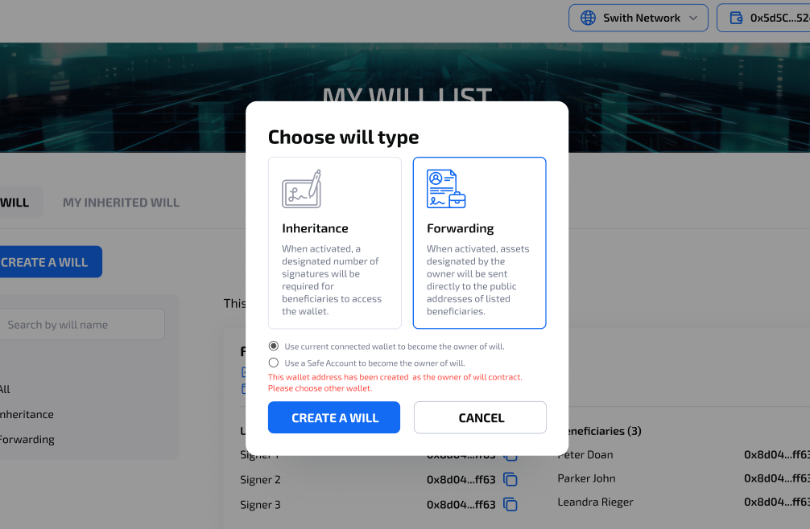
3. In this phase, we can choose both Inheritance and Forwarding
4. Click Forwarding -> Choose **Use a Safe Wallet**-> Click “Create a will” -> Navigate to **Create Will screen**
   1. First, user have to check their Safe Wallet in Checking your Safe Wallet screen
   2. Next, user have to input the address into text box
      1. If user have not Safe account before -> Click [Safe{Wallet} – Welcome](https://app.safe.global/) to create a Safe Account in **Safe Wallet platform**\
         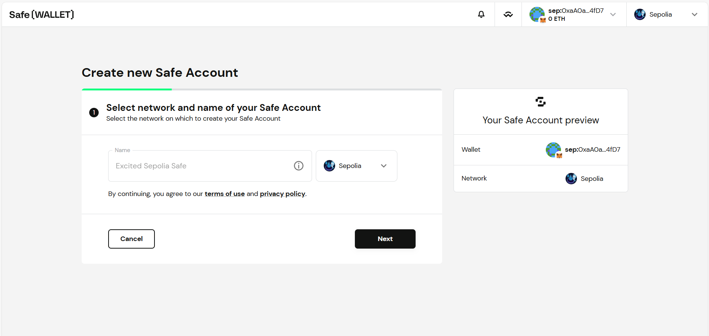
      2. If inputted address is a Safe account -> Enable button Next Step and user can click to navigate to **Configure will screen**

* Click **Next Step** to Configure will details

1. If user choose Use current connected wallet to become owner of will -> Navigate to Configure Will screen

* In this screen user can configure details of will such as: Will name, Beneficiaries list, Assets, Assets allocation details, Activation trigger
* After configure details of will and create the will contract, navigate to Configure Will assets&#x20;
* Click Approve to approve this token to will contract
* Click Deposit or Withdraw to Deposit/Withdraw token to will contract
* Click Finalize to finalize creating will -> navigate to Will screen with latest data

### **3. Appendices** 

_\[Appendices are optional, and are used to provide additional detailed information that may help the end user manage the overall application._

### **4. Index** 

_\[Depending on the size or complexity of the final document, consider pulling together an index to assist the using in location specific information. Index entries correspond to tags or categories, and are useful in navigating long books.]_
