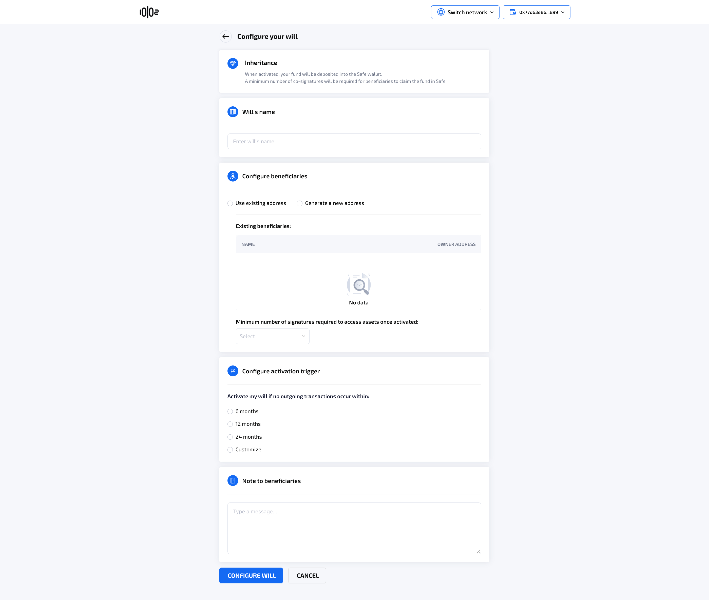
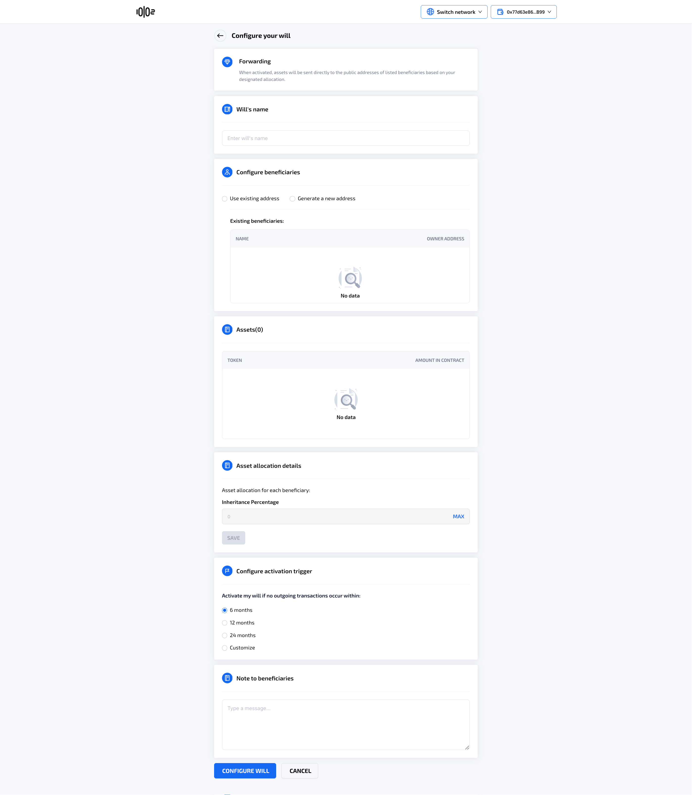
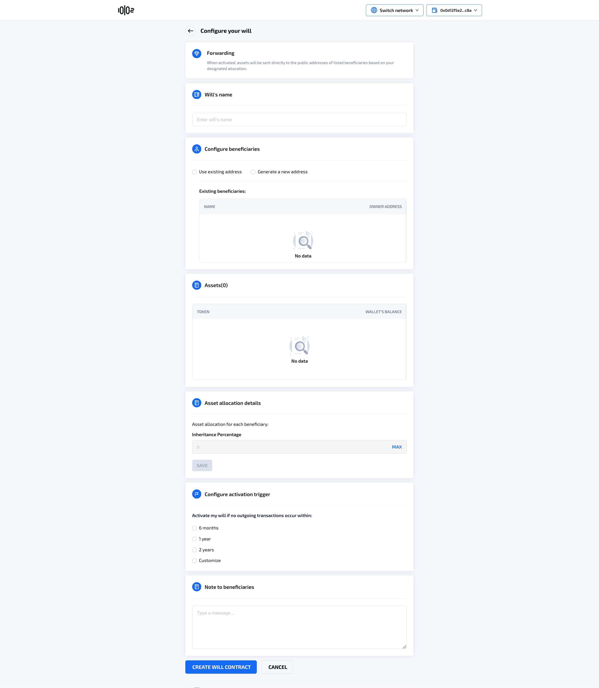

# Create a will

### **Table of contents** 

[Create an Inheritance will with Safe Wallet](create-a-will.md#l6ugmfkjrqu0)

[Create a Forwarding will with Safe Wallet](create-a-will.md#id-7z308uhitv5g)

[Creating a Forwarding will with an Externally-Owned Account (EOA)](create-a-will.md#creating-a-forwarding-will-with-an-externally-owned-account-eoa)

### Create an **Inheritance will with Safe Wallet** 

See also [Inheritance will](../../inheritance-will.md)

* User clicks on “Create a will”&#x20;
*   User chooses Inheritance type of will\

    <figure><figcaption></figcaption></figure>
* The system will navigate to the next screen

<figure><figcaption></figcaption></figure>

If the user doesn't have a Safe account, the system instructs the user to create one at [Safe{Wallet} – Welcome](https://app.safe.global/).\

<figure><figcaption></figcaption></figure>

If user puts in a Safe address, the system will enable the **Next step** option to navigate to **Configure your will** screen, where will's name, beneficiaries, time to activation and notes can be inputed.

<figure><figcaption></figcaption></figure>

<figure><figcaption></figcaption></figure>

### **Create a Forwarding will with Safe Wallet** 

See also [Forwarding will](../../forwarding-will.md)

User clicks on **Create a will,** chooses **Forwarding** as the type of will, and selects to use a Safe account.&#x20;

<figure><figcaption></figcaption></figure>

The system will perform the same check that the address is a Safe wallet, similar to **Inheritance,** and navigate the user to the **Configure your will** screen, where will's name, beneficiaries, assets, asset allocations, time to activation and notes can be inputed.

<figure><figcaption></figcaption></figure>

### **Creating a Forwarding will with an Externally-Owned Account (EOA)**

User clicks on **Create a will,** chooses **Forwarding** as the type of will, and selects to use current connected wallet.

<figure><figcaption></figcaption></figure>

When the user clicks Create a will, the system will navigate to the **Configure your will** screen, where will's name, beneficiaries, assets, asset allocations, time to activation and notes can be inputed.

<figure><figcaption></figcaption></figure>
