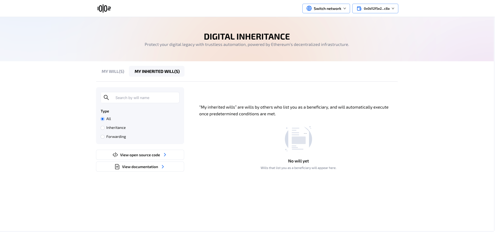
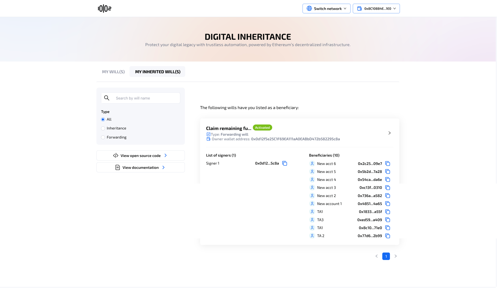

# Will details

### **Table of contents** 

[My will(s)](will-details.md#l6ugmfkjrqu0)

[My will details screen (with Safe Wallet)](will-details.md#my-wills-details-screen-with-safe-wallet)

[My will details screen (with EOA)](will-details.md#my-will-details-screen-with-eoa)

[My Inherited will(s)](will-details.md#id-9tlp3kbavosd)

[My inherited will's details screen](will-details.md#my-inherited-wills-details-screen)

### **My will(s)** 

<figure><figcaption>
Wills created by the owner will appear under My will(s)
</figcaption></figure>

* **My will(s)** displays all the wills user has created, or wills created with a Safe Wallet that the user is a co-signer.
* User can filter or search will with search bar and ratio.
* User can click to right arrow of each will tag to view **My will details screen.**

### **My will's details screen (with Safe Wallet)**

After a will is created with a Safe Wallet, it will initially have the status **Needs finalizing**, which requires a minimum number of co-signers to sign on the transaction in order to finalize creating the will contract. The minimum number of signatures is set in the Safe Account. Co-signers can provide signatures through the 10102's Digital Inheritance app, or through the Safe wallet platform.

<figure><figcaption></figcaption></figure>

* Co-signers of the Safe account can finalize the will contract, which will incur a gas fee. The will status will then change to **Live**. Similarly, user can execute this transaction in Safe Wallet platform.
* Once the minimum number of signatures required in the Safe wallet is met, the will is then **Live**. Once the will status is **Live,** user can **edit/delete** the will by clicking button **Edit will/ Delete will.** Check out the [Edit or delete a will](edit-or-delete-a-will.md) guide for more details

<figure><figcaption></figcaption></figure>

### **My will's details screen (with EOA)**

After creating, the will's status is immediately **Live.** Unlike wills created with a Safe wallet, no finalizing is needed.

<figure><figcaption></figcaption></figure>

* At anytime before the will is activated, the will owner can click the button **“I’m still alive”** to reset time to activation. This action will incur a gas fee.
* When the will is live, the will owner can **edit/delete** the will by clicking the button **Edit will/ Delete will.** Check out the [Edit or delete a will](edit-or-delete-a-will.md) guide for more details.

### **My Inherited will(s)**  

* User can view the list of Inherited wills which list them as a beneficiary
* Clicking on the right arrow in right side of the will will take the user to the will's details screen

### **My inherited will's details screen**

<figure><figcaption></figcaption></figure>

The status **Not activated** indicates that no beneficiaries have activated the will to claim fund, or the will's time to activation has not fully elapsed. Once enough time has passed, and one of the beneficiaries successfully initiate the claiming fund process, the will's status will become **Activated**. More on [Activate a will and claim fund](activate-a-will-and-claim-fund.md).&#x20;
