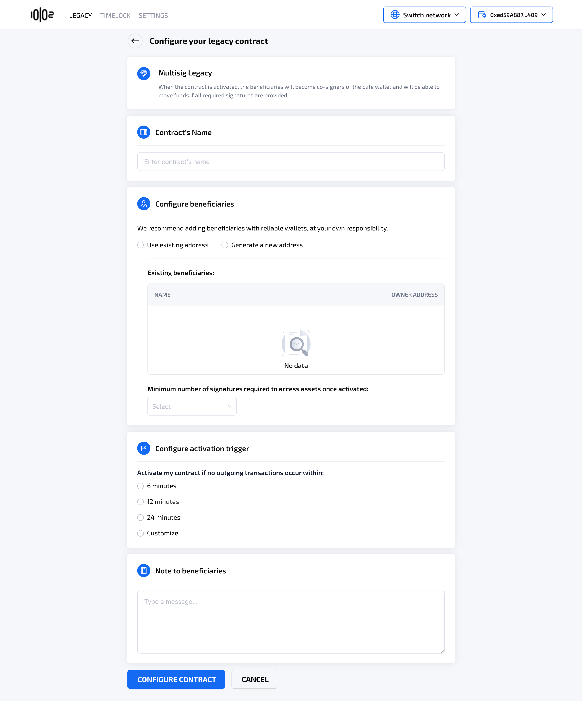
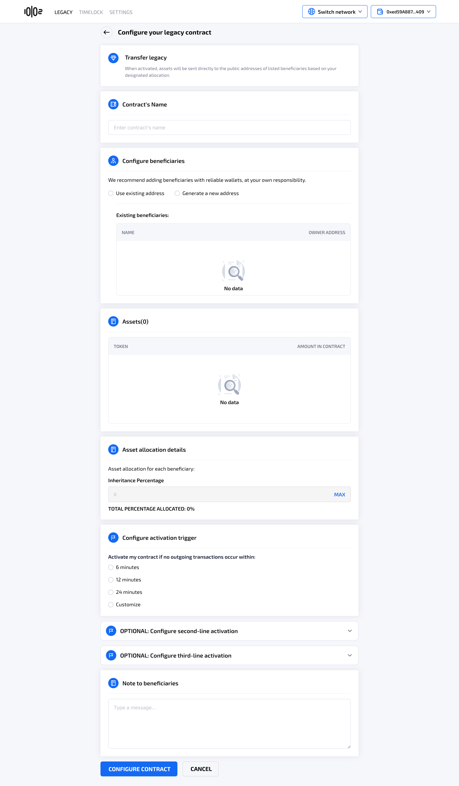

# Create a Legacy Contract

### **Table of Contents** 

[Create a Multisign Legacy Contract with Safe Wallet](create-a-legacy-contract.md#create-a-multisig-legacy-contract-with-safe-wallet)

[Create a Transfer Legacy Contract with Safe Wallet](create-a-legacy-contract.md#create-a-transfer-legacy-contract-with-safe-wallet)

[Create a Transfer Legacy Contract with an Externally-Owned Account (EOA)](create-a-legacy-contract.md#creating-a-transfer-legacy-contract-with-eoa)

### Create a Multisig Legacy Contract **with Safe Wallet** 

See also [Multisig Legacy](./)

* User clicks on “Create a Contract”&#x20;
* User chooses Multisig Legacy
* The system will navigate to the Check your Safe wallet screen

<figure><figcaption></figcaption></figure>

<figure><figcaption></figcaption></figure>

If the user doesn't have a Safe account, the system instructs the user to create one at [Safe{Wallet} – Welcome](https://app.safe.global/). 

<figure><figcaption></figcaption></figure>

If user puts in a Safe address, the system will enable the **Next step** option to navigate to **Configure your Legacy Contract** screen, where the contract's name, beneficiaries, time to activation and notes can be inputed.

<figure><figcaption></figcaption></figure>

<figure><figcaption></figcaption></figure>

### **Create a Transfer Legacy Contract with Safe Wallet** 

See also [Transfer Legacy](/broken/pages/ihnCcEU1uVbGe5DrwEhI)

* There are 2 options for user to choose from, creating a Transfer Legacy contract with an EOA or a Safe wallet.
* User clicks on **Create a Contract,** chooses **Transfer Legacy**, and selects to use a Safe account.&#x20;

<figure><figcaption></figcaption></figure>

The system will perform the same check that the address is a Safe wallet, similar to **Multisig Legacy,** and navigate the user to the **Configure Your Legacy Contract** screen, where contract's name, beneficiaries, assets, asset allocations, time to activation and notes can be inputed.

<figure><figcaption></figcaption></figure>

* Alternatively, the legacy owner can create a Safe wallet in [https://app.safe.global](https://app.safe.global/). The legacy is set as a legacy contract using Safe Proxy.
* After setting the legacy contract in Safe Proxy, the will owner can set guard in [https://app.safe.global](https://app.safe.global/) or in the Digital Inheritance's site. The system uses Set Guard Function of SafeGuard.
* The legacy owner can set module in [https://app.safe.global](https://app.safe.global/) or in the Digital Inheritance's site using Set Module function.
* After setting guard and module, the legacy owner can configure will details including asset, beneficiaries and time to activation since last outgoing transaction.
* Co-signers of the Safe Wallet will need to sign a transaction to finalize creating the legacy contract. Once the minimum number of signatures required in the Safe Wallet is met, the legacy contract is created.

### **Creating a Transfer Legacy Contract with an Externally-Owned Account (EOA)** 

* There are 2 options for user to choose from, creating a Transfer Legacy contract with an EOA or a Safe wallet.
* User clicks on **Create a Contract,** chooses **Transfer Legacy,** and selects to use current connected wallet.

<figure><figcaption></figcaption></figure>

When the user clicks Create a contract, the system will navigate to the **Configure Your Legacy Contract** screen, where contract's name, beneficiaries, assets, asset allocations, time to activation and notes can be inputed.

By default, users may designate up to **10 primary beneficiaries** per legacy contract.&#x20;

**Configure assets allocations**

* In order to ensure that beneficiaries can receive the assets, the owner will have to:
  * Approve ERC-20 tokens in order for the contract to have the permission to transfer assets to beneficiaries' wallets when the will is activated. All ERC-20 tokens in the EOA wallet can still be spent normally.
  * Transfer Native tokens (ETH) to the legacy contract. Owner can deposit only a portion of their ETH. The contract will hold custody of the deposited ETH. The owner can always edit the legacy contract and withdraw the deposited ETH from the will contract.&#x20;

<figure><figcaption></figcaption></figure>

* Asset allocation details for beneficiaries:
  * User can specify the percentage of each beneficiary, as long as the total is 100%.\
    Example: There are four beneficiaries: A, B, C, D. The owner can specify that A will receive 20% of the assets, B 10%, C 30%, and D 40%. The allocation will apply to the deposited Ether and approved ERC-20 tokens from the EOA wallet.

<figure><figcaption></figcaption></figure>

#### Premium Feature: Additional Contingent Beneficiary Layers

As part of the Premium package, the user can optionally configure up to two additional layers of access recovery.

See [Premium Features - Additional Contingent Beneficiary Layers](../premium-features/#additional-contingent-beneficiary-layers)

<figure><figcaption></figcaption></figure>
