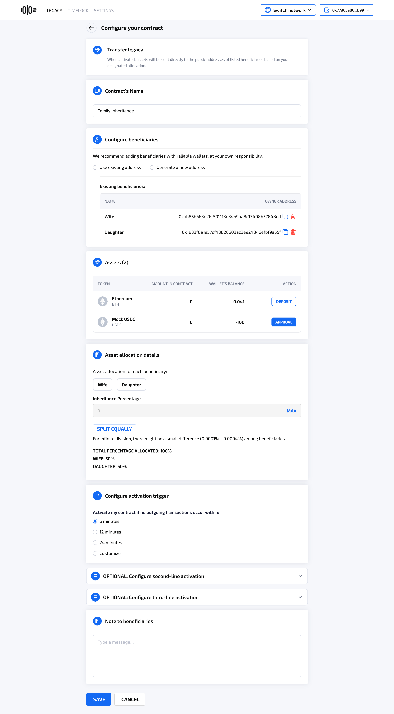

# Edit or Delete a Legacy Contract

### **Table of Contents** 

[Edit a Legacy Contract created with a Safe wallet](edit-or-delete-a-legacy-contract.md#edit-a-legacy-contract-created-with-a-safe-wallet)

[Delete a Legacy Contract created with a Safe wallet](edit-or-delete-a-legacy-contract.md#delete-a-legacy-contract-created-with-a-safe-wallet)

[Edit a Legacy Contract created with an EOA](edit-or-delete-a-legacy-contract.md#edit-a-legacy-contract-created-with-an-eoa)

[Delete a Legacy Contract created with an EOA](edit-or-delete-a-legacy-contract.md#delete-a-legacy-contract-created-with-an-eoa)

### Edit a Legacy Contract created with a Safe Wallet

<figure><figcaption></figcaption></figure>

* After creating the legacy contract successfully, the owner can add more beneficiaries and/or adjust the time to activation.
* If the user clicks on **Edit contract,** the system will navigate to **Edit your legacy contract** screen where the user can make edits to the legacy contract's name, beneficiaries, minimum number of signatures required, time to activation, and note to beneficiaries.
* Approving, depositing, withdrawing tokens, and editing Note to beneficiaries will not reset the contract's time to activation. All other actions will reset the contract's time to activation.
* Co-signers of the Safe Wallet will need to sign a transaction to finalize editing the legacy contract. Once the minimum number of signatures required in the Safe Wallet is met, the contract is updated.

### Delete a Legacy Contract created with a Safe Wallet

* After creating legacy contract successfully, the owner can delete legacy contract.
* If the user clicks on **Delete contract**, the system will prompt a popup to confirm the action. After that, a minimum number of signatures from co-signers is required to finalize deleting the contract.

<figure><figcaption></figcaption></figure>

* After the owner edit or delete the contract and sign their first signature, the contract's status will change to **Needs finalizing to update/delete** until the number of minimum signatures required are met. Co-signers of the Safe Wallet will need to sign a transaction to finalize deleting the legacy contract.&#x20;
* Once the minimum number of signatures required in the Safe Wallet is met, the legacy contract is deleted. The native token(s) in the contract will be transferred back to owner's Safe wallet. All approval functions of ERC-20 tokens are cancelled.

<figure><figcaption></figcaption></figure>

### Edit a Legacy Contract created with an EOA

* If the user clicks on **Edit contract,** the system will navigate to **Edit your legacy contract** screen where the user can make edits to the legacy contract's name, beneficiaries, asset allocations, time to activation, note to beneficiaries, and approve or deposit/withdraw tokens.
* Unlike a legacy contract created with a Safe wallet, there is no finalizing needed for editing a contract created with an EOA.

<figure><figcaption></figcaption></figure>

For Legacy Contract created with an EOA, editing the contract will not reset the time to activation. User can use the option "I'm still alive" if they wish to extend the activation timeline.

<figure><figcaption></figcaption></figure>

### Delete a Legacy Contract created with an EOA

* If the user clicks on **Delete Contract**, the system will prompt a popup to confirm the action before proceeding to delete the legacy contract and return any deposited funds to the owner's wallet.&#x20;
* Unlike a legacy contract created with a Safe wallet, there is no finalizing needed for deleting a contract created with an EOA.
* After the contract is deleted, the native token(s) in the contract will be transferred back to owner's EOA wallet. All approval functions of ERC-20 tokens are cancelled.
