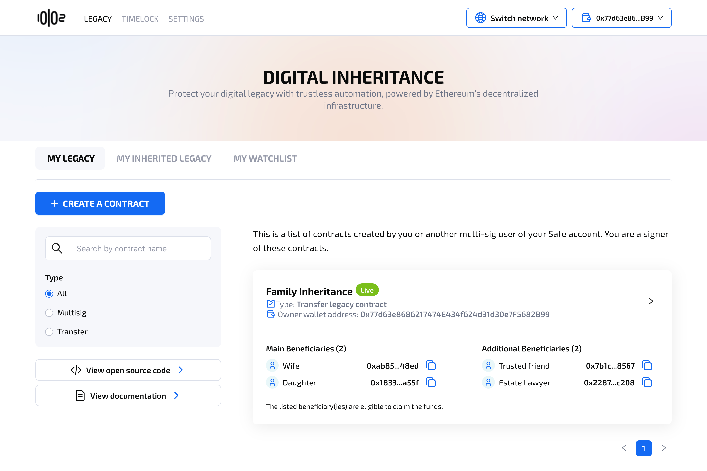
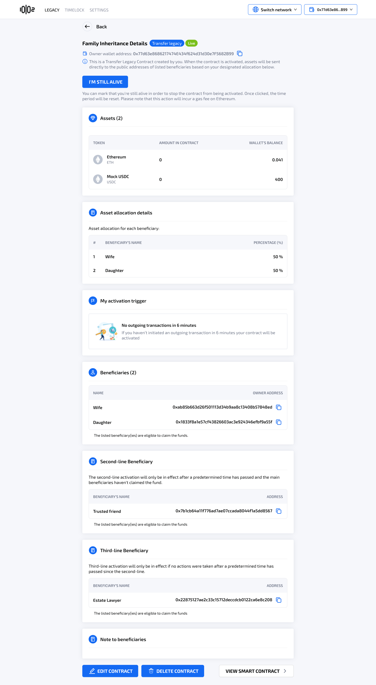
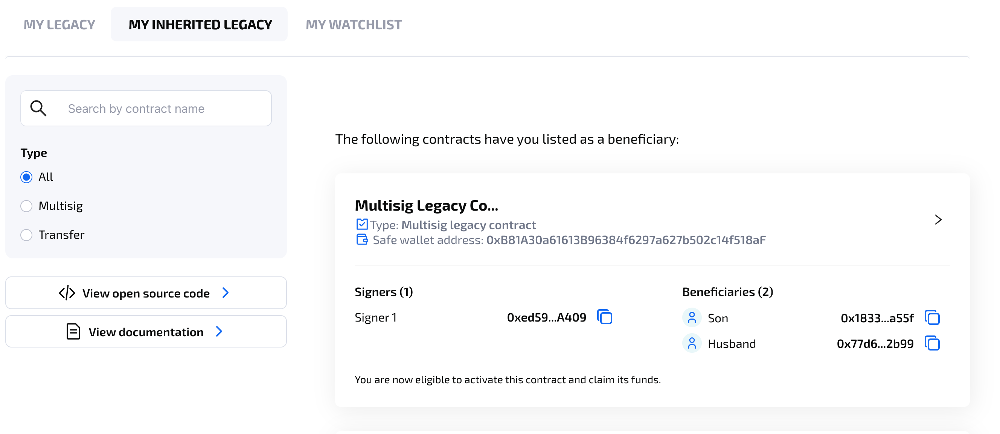
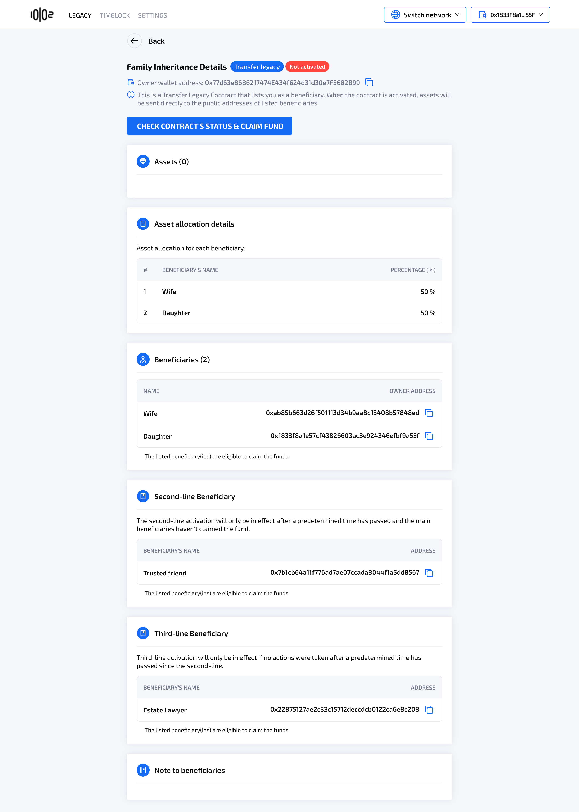

# Legacy Contract Details

### **Table of contents** 

[My Legacy](legacy-contract-details.md#l6ugmfkjrqu0)

[My Legacy Contract Details Screen (with Safe Wallet)](legacy-contract-details.md#my-wills-details-screen-with-safe-wallet)

[My Legacy Contract Details Screen (with EOA)](legacy-contract-details.md#my-legacy-contract-details-screen-with-eoa)

[My Inherited Legacy](legacy-contract-details.md#id-9tlp3kbavosd)

[My Inherited Legacy Details Screen](legacy-contract-details.md#my-inherited-legacy-contract-details-screen)

### **My Legacy** 

<figure><figcaption></figcaption></figure>

* **My legacy** displays all the legacy contracts user has created, or legacy contracts created with a Safe Wallet that the user is a co-signer.
* User can filter or search contracts with search bar and ratio.
* User can click to right arrow of each contract to view the details

### **My Legacy Contract Details Screen (with Safe Wallet)**

After a legacy contract is created with a Safe Wallet, it will initially have the status **Needs finalizing**, which requires a minimum number of co-signers to sign on the transaction in order to finalize creating the legacy contract. The minimum number of signatures is set in the Safe Account. Co-signers can provide signatures through the 10102's Digital Inheritance app, or through the Safe wallet platform.

<figure><figcaption></figcaption></figure>

<figure><figcaption></figcaption></figure>

* Co-signers of the Safe account can finalize the legacy contract, which will incur a gas fee. The will status will then change to **Live**. Similarly, user can execute this transaction in Safe Wallet platform independent of 10102's UI.
* Once the minimum number of signatures required in the Safe wallet is met, the legacy contract is then **Live**. Once the contract status is **Live,** user can **edit/delete** the contract by clicking button **Edit contract/ Delete contract.** Check out the [Edit or delete a legacy contract](edit-or-delete-a-legacy-contract.md) guide for more details

<figure><figcaption></figcaption></figure>

### **My Legacy Contract Details Screen (with EOA)**

After creating, the legacy contract status is immediately **Live.** Unlike wills created with a Safe wallet, no finalizing is needed.

<figure><figcaption></figcaption></figure>

* At anytime before the legacy contract is activated, the contract owner can click the button **“I’m still alive”** to reset time to activation. This action will incur a gas fee.
* When the legacy contract is live, the contract owner can **edit/delete** the contract by clicking the button **Edit contract/ Delete contract.** Check out the [Edit or delete a legacy contract](edit-or-delete-a-legacy-contract.md) guide for more details.

### **My Inherited Legacy** 

* User can view the list of Inherited legacy contracts which list them as a beneficiary
* Clicking on the right arrow in right side of the contract card will take the user to the legacy contract details screen

<figure><figcaption></figcaption></figure>

### **My Inherited Legacy Contract Details Screen**

<figure><figcaption></figcaption></figure>

The status **Not activated** indicates that no beneficiaries have activated the legacy to claim fund, or the legacy contract time to activation has not fully elapsed. Once enough time has passed, and one of the beneficiaries successfully initiates the claiming fund process, the contract status will become **Activated**. More on [Activate a legacy contract and claim funds](activate-a-legacy-contract-and-claim-funds.md).&#x20;
