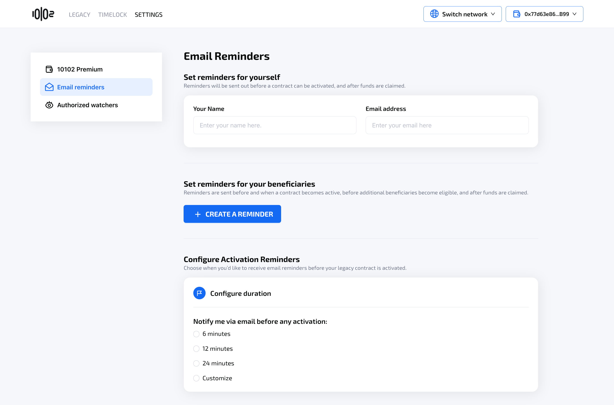
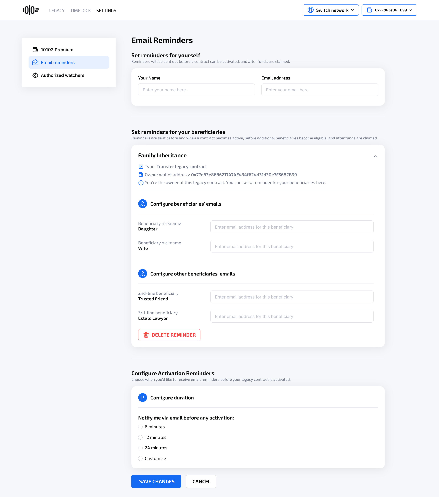

# Configure Email Reminders

In order to configure Email Reminders, you need to be a 10102 Premium user.

Email notifications are sent for the following events:

* **Upcoming activations**\
  Notifications are sent _X days before_ contract activation, second-line activation, and third-line activation. Emails are delivered to the owner and the beneficiaries impacted by the upcoming activation.
* **Activation events**\
  When an activation takes effect, email notifications are sent to the beneficiaries eligible at that stage.
* **Activation timeline resets**\
  When the owner resets the activation timeline, beneficiaries who are scheduled to become eligible at that time receive an email notification.
* **Successful claims**\
  When a legacy contract is claimed by any beneficiary, the owner and all impacted beneficiaries receive an email notification outlining the asset distribution.

Beneficiaries receive notifications only for stages in which they are impacted. For example:

* Second-line and third-line beneficiaries do not receive notifications for the initial activation. They will receive notifications before and when the their respective activation event takes effect.
* Primary beneficiaries receive notifications both before and when the second-line activation takes effect, since this activation event can impact their planning.
* Before and when the third-line activation takes effect, all primary, second-line, and third-line beneficiaries receive notifications.

The user can create a reminder for each of their legacy contracts by navigating to Settings > Email Reminders > Create a Reminder and choose the legacy contract they want to set a reminder for.

<figure><figcaption></figcaption></figure>

<figure><figcaption></figcaption></figure>

<figure><figcaption></figcaption></figure>

The system will ask for email addresses of the owner and beneficiaries, as well as the advanced notice period.

The user can edit and delete reminder setup at anytime on the same screen.
