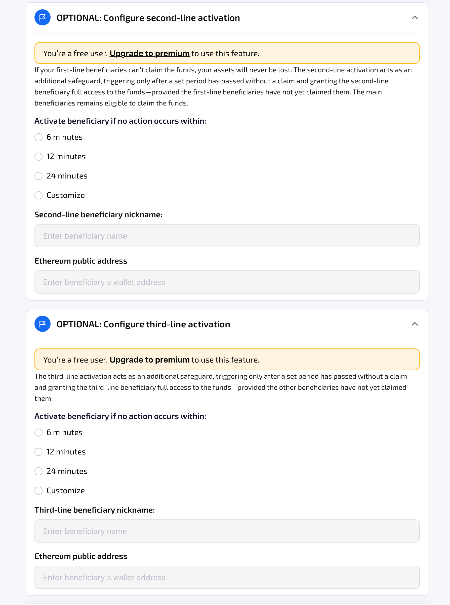

# Manage Contingent Beneficiaries

By default, users may designate up to **10 primary beneficiaries** per legacy contract. Primary beneficiaries can always claim the funds, and only **one** designated beneficiary needs to initiate the claim for all beneficiaries to receive access according to the predefined allocation.

As part of the Premium package, users can configure up to two layers of contingent beneficiaries. One additional beneficiary in the form of an EOA is allowed per additional line of activation.

### Configure Second-line and Third-line Activation

The user can optionally configure the second-line and third-line activation when creating a new transfer legacy contract. Additional activation layers can also be added or modified later by editing the legacy contract, provided the contract has not yet reached its activation point.

<figure><figcaption></figcaption></figure>

#### **Second-Line Activation**

User can optionally designate one beneficiary for the second-line activation. The second-line activation takes effect only after a predetermined time window has elapsed without a successful claim from the primary beneficiaries. This time window is fully configurable by the contract owner.

Once the second-line activation is active, **both primary beneficiaries and second-line beneficiaries are eligible to claim the funds**, with asset distribution following the rules of the corresponding layer.

* Primary beneficiaries remain eligible to claim the funds **as long as they do so before the second-line beneficiary takes action**. In this case, asset distribution follows the original allocation among the primary beneficiaries.
* If a second-line beneficiary successfully claims the funds, they become the **sole beneficiary** of the funds in the legacy contract.
* Once an eligible beneficiary successfully claims the funds, no other beneficiaries may claim thereafter.

#### **Third-Line Activation**

User can optionally designate one beneficiary for the third-line activation. The third-line activation takes effect only after a predetermined time window has elapsed following the second-line activation period, provided no claim has been made by either the primary or second-line beneficiaries. This time window is also fully configurable by the contract owner.

Once the third-line activation is active, **primary beneficiaries and second-line beneficiaries remain eligible to claim the funds**, with asset distribution following the rules of the corresponding layer, as outlined above.&#x20;

If a third-line beneficiary successfully claims the funds, they become the sole beneficiary of the funds in the legacy contract.

Second-line and third-line beneficiaries are, by default, designated as **watchers** with **limited visibility** on the contract. Once their respective activation stage takes effect, they become eligible beneficiaries and can view the full visibility and claim the legacy contract accordingly.

* Before their line of activation takes effect, second-line and third-line beneficiaries can see the contract under "My Watchlist".
* The system will inform whether the user is seeing the contract as a watcher or as a contingent beneficiary.
* Once their respective line of activation kicks in, the second-line and third-line beneficiaries can see the contract under "My Inherited Legacy"

<figure><figcaption></figcaption></figure>
