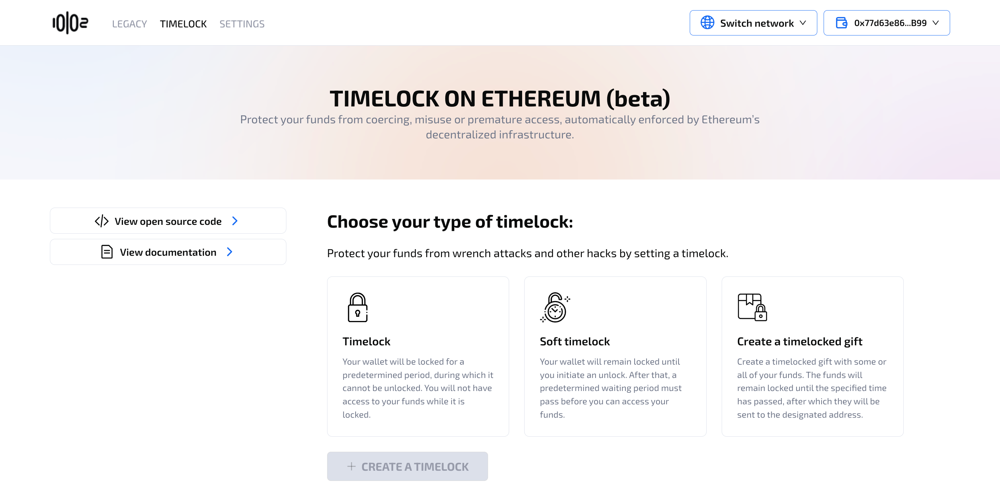
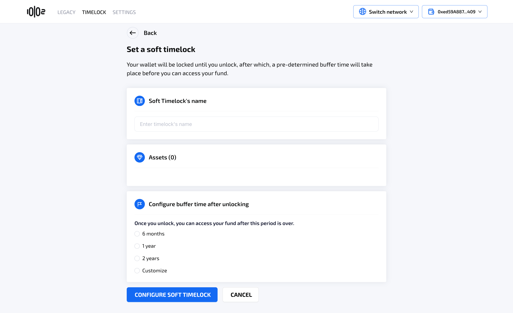
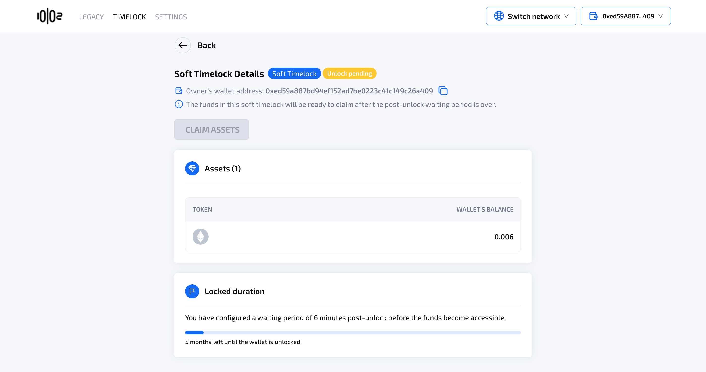
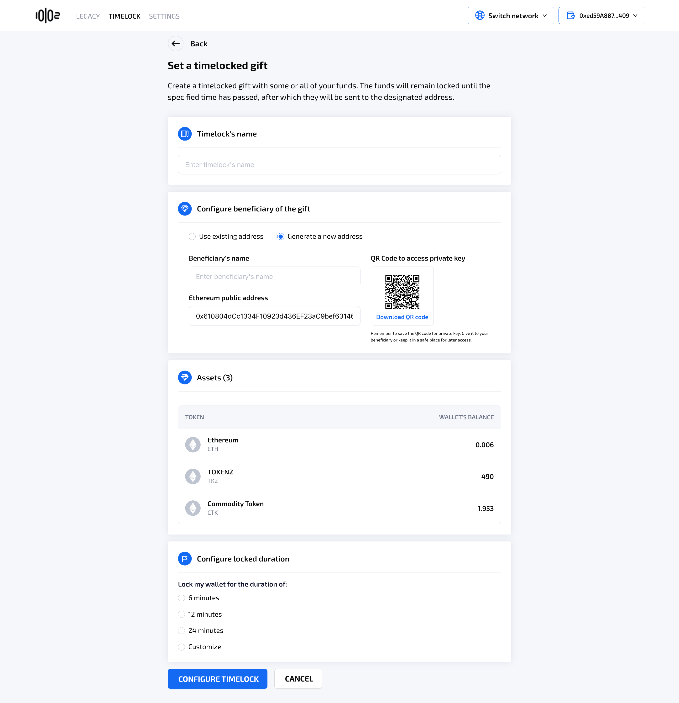
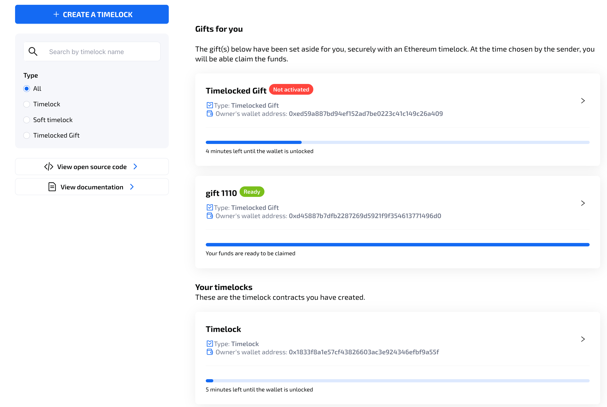
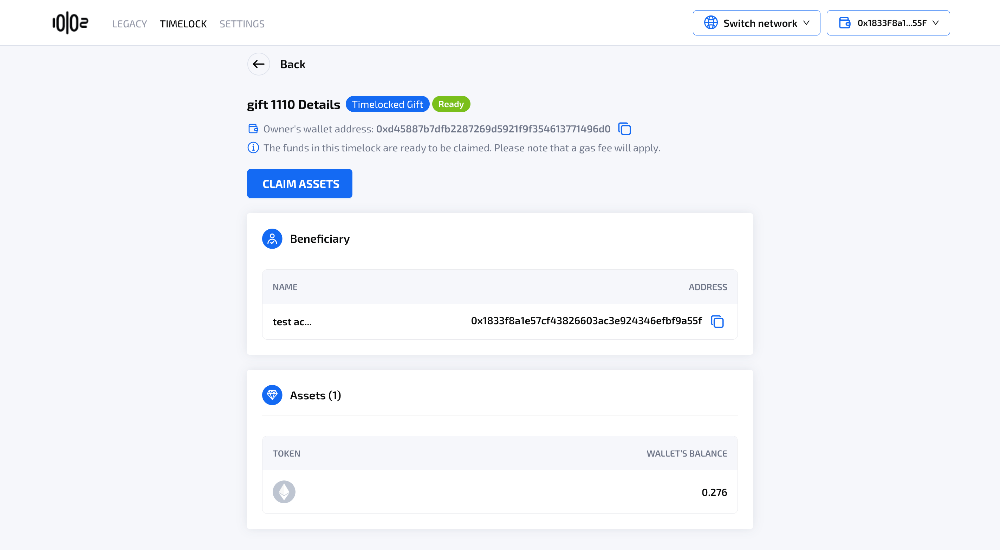

# Using Timelock

User can navigate to the Timelock section of the app and choose between 3 options of timelock configurations, depending on the use case.

<figure><figcaption></figcaption></figure>

### **Table of Contents** 

[**Timelock**](using-timelock.md#timelock)

[**Soft Timelock**](using-timelock.md#soft-timelock)

[**Timelocked Gift**](using-timelock.md#timelocked-gift)

### Timelock

This feature will lock the funds until a specified date. Nobody, including the owner, will  have access to the locked funds while it is locked. After the locked period, the owner then can claim back the funds.

#### Create a Timelock

Once the user selects the Timelock option and proceed to create a timelock, they will see  the following screen, where they can configure timelock's name, approve or deposit assets (native asset ETH requires deposit into the contract), and locked duration.

<figure><figcaption></figcaption></figure>

<figure><figcaption></figcaption></figure>

#### Claim Assets

Once the locked period is over, the system will inform the user via the progress bar and the status "Ready". The user can go to the timelock details page to claim back their assets.

<figure><figcaption></figcaption></figure>

<figure><figcaption></figcaption></figure>

## Soft Timelock

This will lock the funds for an unlimited amount of time, and require a pre-configured waiting period after the owner initiate an unlock, safeguarding funds even if private keys are compromised.

#### Create a Soft Timelock

Once the user selects the Soft Timelock option and proceed to create a soft timelock, they will see the following screen, where they can configure the soft timelock's name, approve or deposit assets (native asset ETH requires deposit into the contract), and the waiting period.

<figure><figcaption></figcaption></figure>

#### Unlock a Soft Timelock

From a timelock dashboard, the user can unlock a soft timelock at any point by clicking the "Unlock" button.

<figure><figcaption></figcaption></figure>

The system will then initiate the unlock process, with the status of the soft timelock changed to "Unlock pending".

<figure><figcaption></figcaption></figure>

<figure><figcaption></figcaption></figure>

While the unlock is pending, the user can't claim the assets in the soft timelock.

#### Claim Assets

Once the waiting period is over, the system will inform the user via the progress bar and the status "Ready". The user can go to the soft timelock details page to claim back their assets.

<figure><figcaption></figcaption></figure>

## Timelocked Gift

Timelocked Gift allows scheduled fund delivery to another wallet - ideal for scheduled payments, trust-fund style disbursements, or planned giving.

#### Create a Timelocked Gift

Once the user selects the Timelocked Gift option and proceed to create a timelocked Gift, they will see the following screen, where they can configure timelocked gift's name, approve or deposit assets (native asset ETH requires deposit into the contract), and locked duration.

The timelocked gift feature is unique in that the user can designate another wallet address to be the recipient of the funds once the locked period is over.

<figure><figcaption></figcaption></figure>

All users will see 2 separate sections on their timelock dashboard, one for the timelocked gifts to them from another user, and the timelocks they created.

<figure><figcaption></figcaption></figure>

#### Claim Assets

Once the locked period is over, the system will inform the recipient via the progress bar and the status "Ready" in their timelock dashboard. The user can go to the timelocked gift details page to claim the funds gifted to them.

<figure><figcaption></figcaption></figure>

